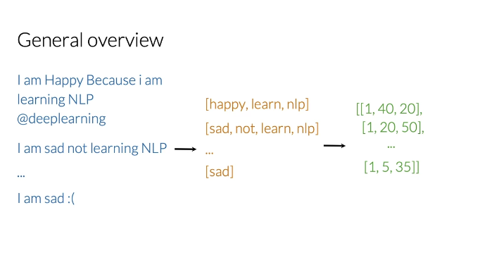
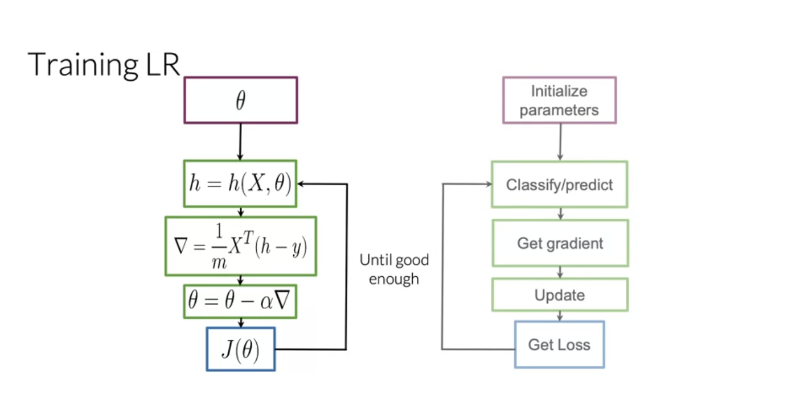

# Week 1

# 1 Supervised ML (training) & Sentiment Analysis

## 1.1 Supervised ML

  

## 1.2 Sentiment Analysis

  

### 1.2.1 Feature extraction

  
  

### 1.2.2 Negative and positive frequencies

- Create frequency table

  
  

### 1.2.3 Feature extraction with frequencies

  
  

### 1.2.4 Preprocessing

1. Stop words and punctuation

For punctuations, it is better to check its importance before preprocessing

  
  

2. Handles (name) and URLs

  

3. Stemming and lowercasing

  

# 2 Put It All Together

## 2.1 General Overview

  

## 2.2 Workflow

  
  

## 2.3 Implementation

  

# 3 Logistic Regression

## 3.1 Overview

  
  

## 3.2 Training

  
  

## 3.3 Testing

Test the accuracy of the model

  

## 3.4 Cost Function

  
  

