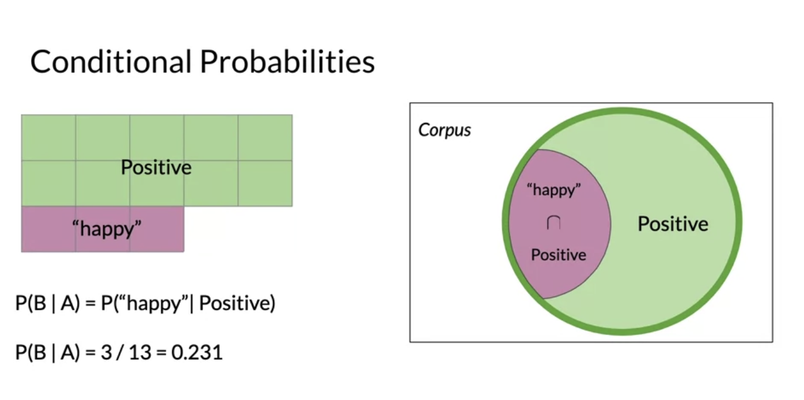

# Week 2

# 1 Probability

- Probability of the word "happy" be categorized as Positive or Negative

  
  

- Probability of the interestion

  

# 2 Bayes' Rule

- Conditional probabilities: P(A|B) = P(A & B) / P(B)
  - Probability of B, given A happened
  - Looking at the elements of set A, the chance that one also belongs to set B

  
  

- Bayes' rule: P(X|Y) = P(Y|X) \* P(X) / P(Y)

  

# 3 Naive Bayes

## 3.1 Introduction

- Naive: features used for the classification are all independent
- Pipeline:

1. Count the pos/neg words

  

2. Calculate the conditional probabilities

  

3. Distinguish words:
   1. Similar prob: neutral words
   2. Pos > Neg: positive words
   3. Neg > Pos: negative words
   4. 0: cannot compare between two corpora

  

4. To avoid this problem, we need to smooth the probability function.

5. Get the value for the tweet: apply Naive Bayes inference condition rule

  

## 3.2 Laplcian Smoothing

- Formula

  

- Calculation

  
  

## 3.3 Log Likelihood

- Ratio of probabilities

  

- Naive Bayes Inference
  - Simple, fast, and powerful baseline
  - A probabilistic model for classification

  

- Log likelihood
  - Product may contain numerical underflow (the number is too small to be stored)

  

- Calculating lambda

  

## 3.4 Training Naive Bayes

- Pipeline

  
  

  
  

  

## 3.5 Test Naive Bayes

  
  

# 4 Applications

- Author identification
- Spam filtering

  

- Information retrieval

  

- Word disambiguation

  

# 5 Naive Base Assumptions

- Independence
  - Assuming words are independnet
  - May give equal probabilities to each word (if Naive Bayes is used to predict the word)

  
  

- Relative frequencies in your corpus

  - Relies on the distributions of the training datasets
  - Most avaliable datasets now are artificially equally distributed

# 6 Error Analysis

- Removing punctuation and stop words

  
  

- Word order

  

- Adversarial attacks

  

