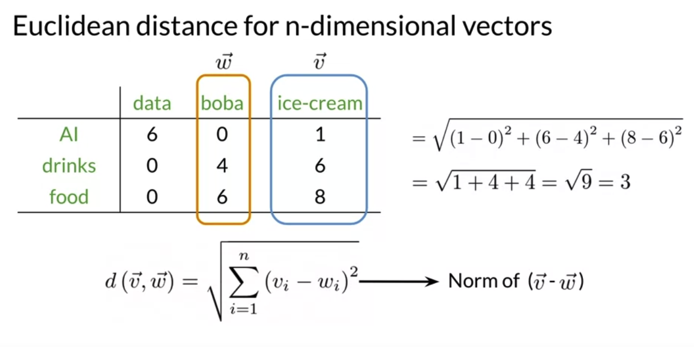
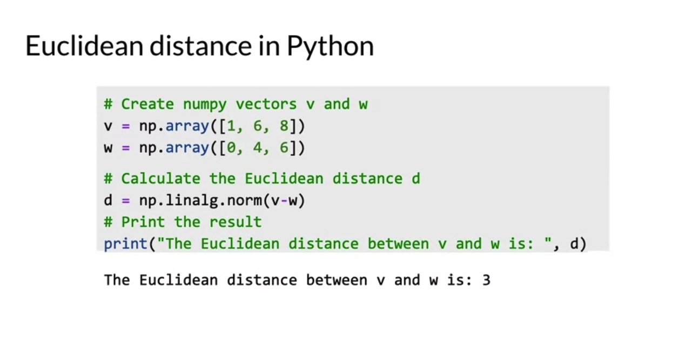
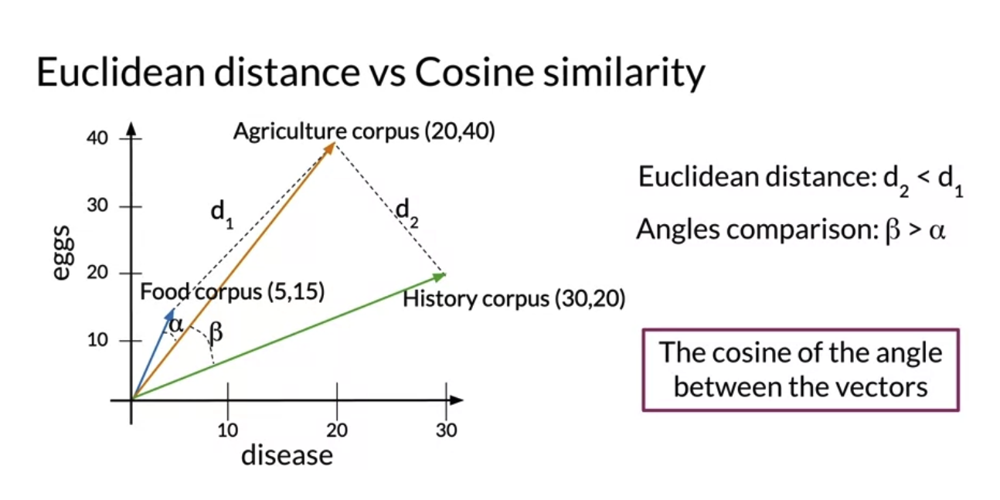
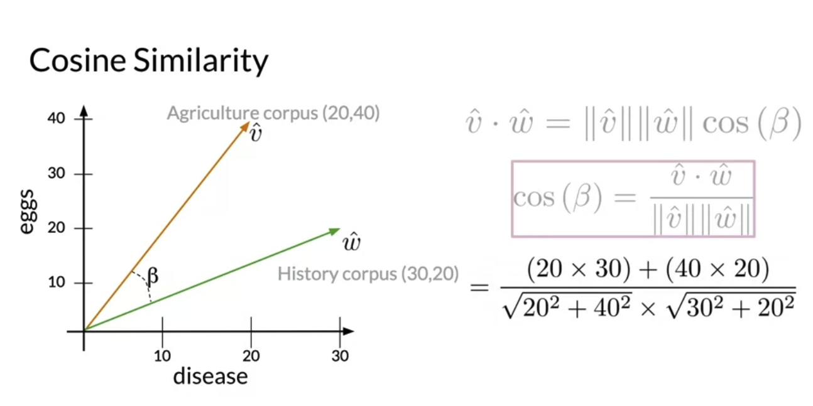

# Week3

# 1 Vector Space Models

<p align="center">
  "You shall know a word by the compay it keeps" -- Firth 1957
</p>

## 1.1 Word By Word / Word By Document

- Word by word design

<p align="center">
  
</p>

- Word by document design

<p align="center">
  
  
</p>

# 2 Distance Formula

## 2.1 Euclidean Distance

- Biased by the size difference between the representations

<p align="center">
  
  
</p>

## 2.2 Cosine Similarities

- **ISN'T** biased by the size difference between the representations

```Python
cosine_similarity = np.dot(a, b) / (np.linalg.norm(a) * np.linalg.norm(b))
```

<p align="center">
  
  
</p>
