# Week 4

# 1 Transforming Two Vectors

- Forming the equation

  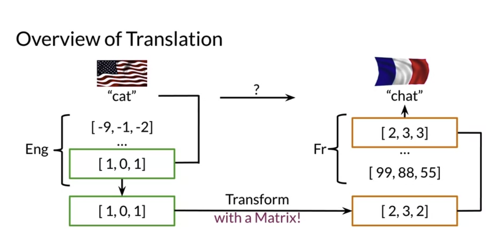
  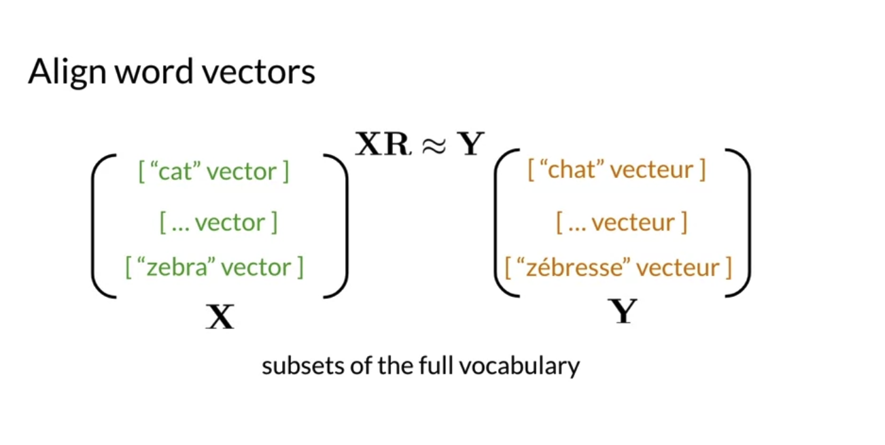

- Solving for R

  

- Frobenius norm

  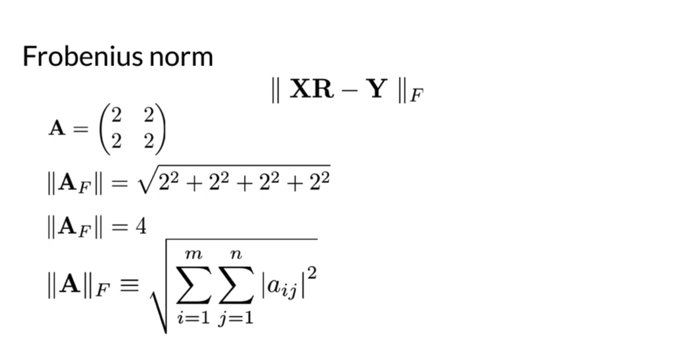
  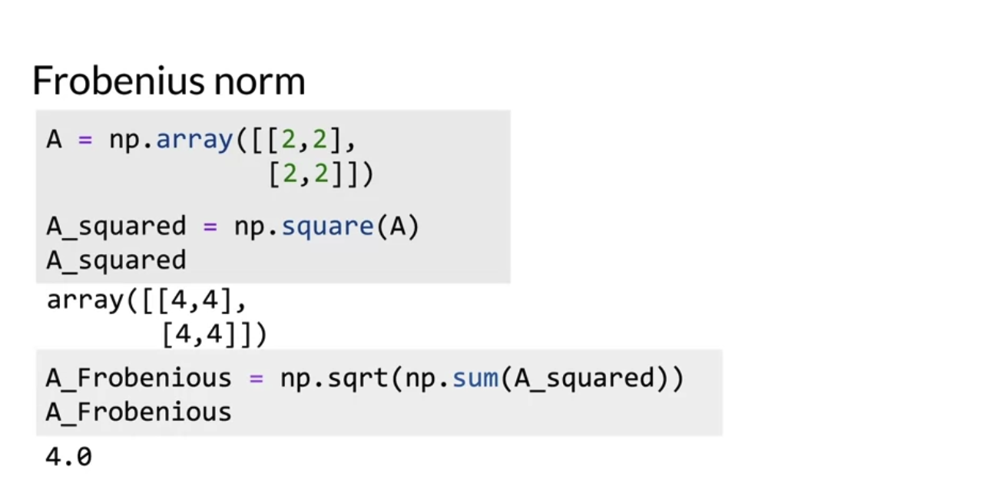

- Gradient

  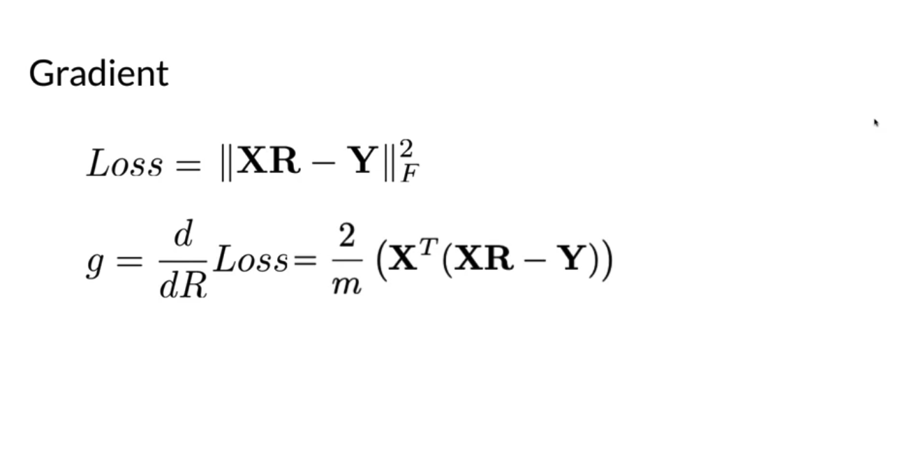

# 2 KNN

## 2.1 Introduction

- Find similar words (KNN)

  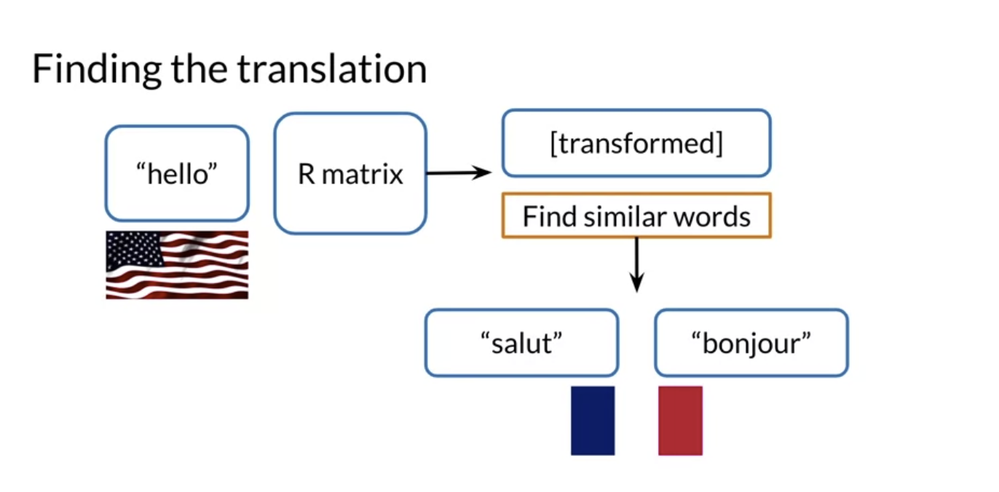

- Use hash tables to efficiently manage the data

  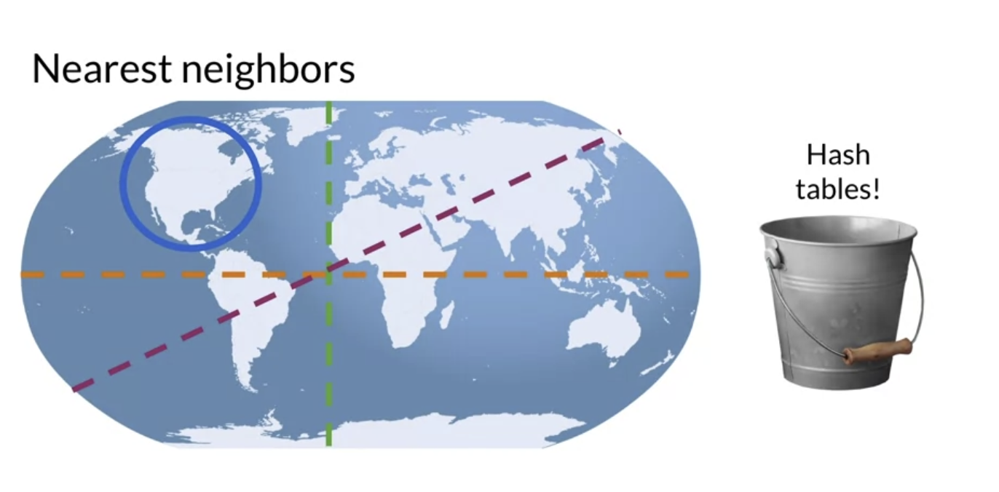

## 2.2 Hashtable and Hash Functions

- Basic hashing

  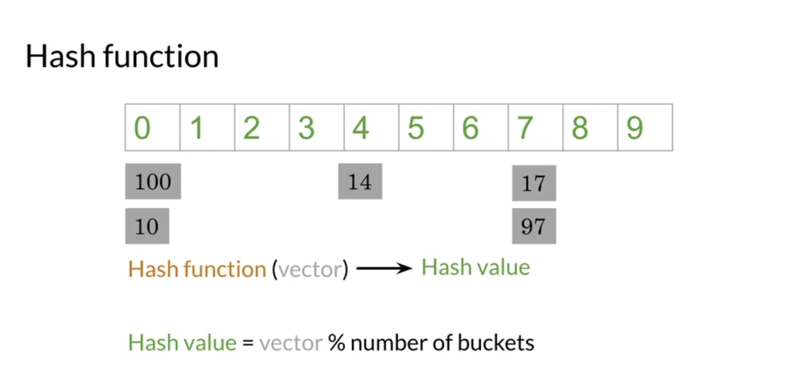
  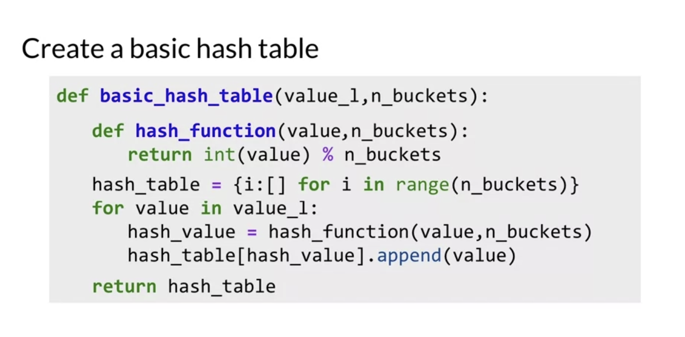

- Locality sensitive hashing

  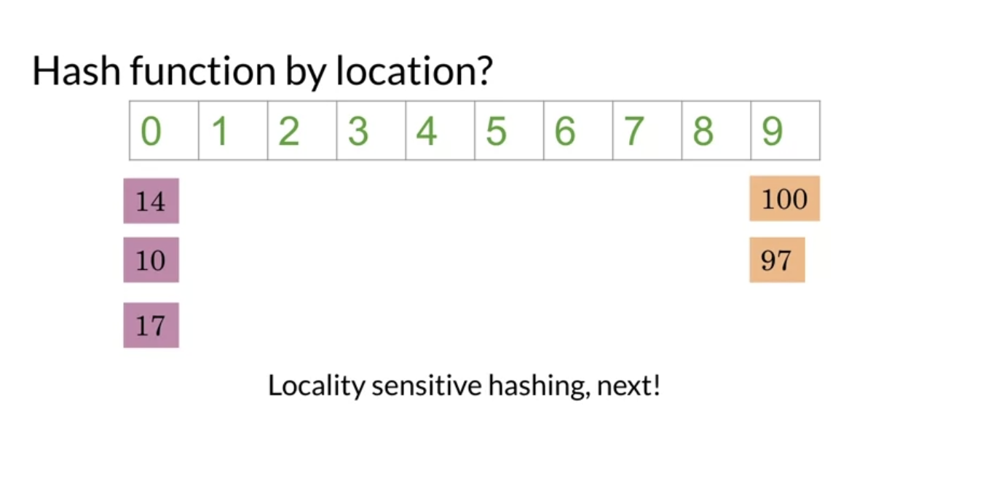

## 2.3 Locality Sensitive Hashing

- A hash function that is sensitive to location

  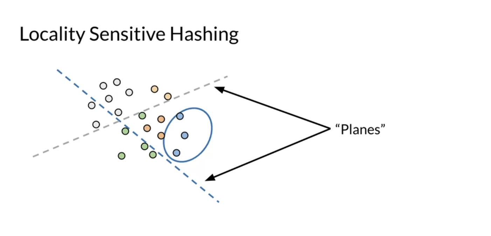
  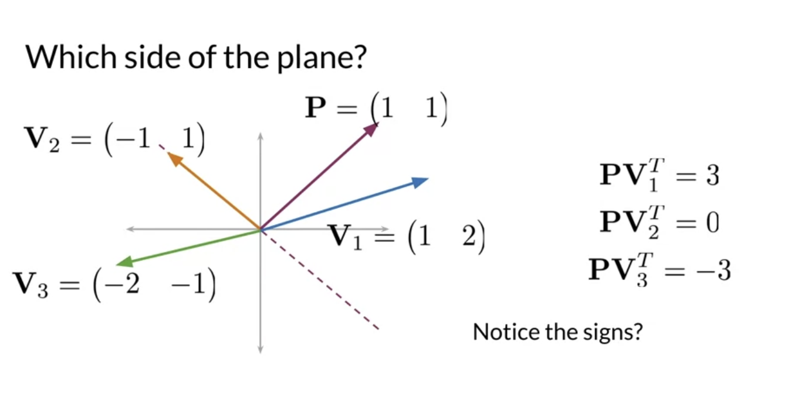

- Visualizing dot product -> projection

  
  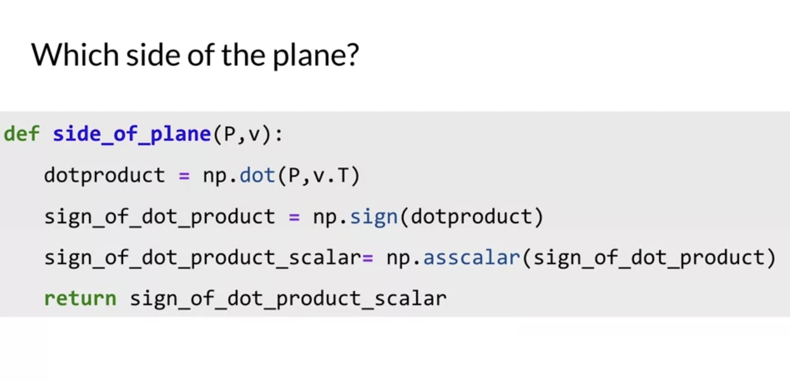

## 2.4 Multiple Planes

  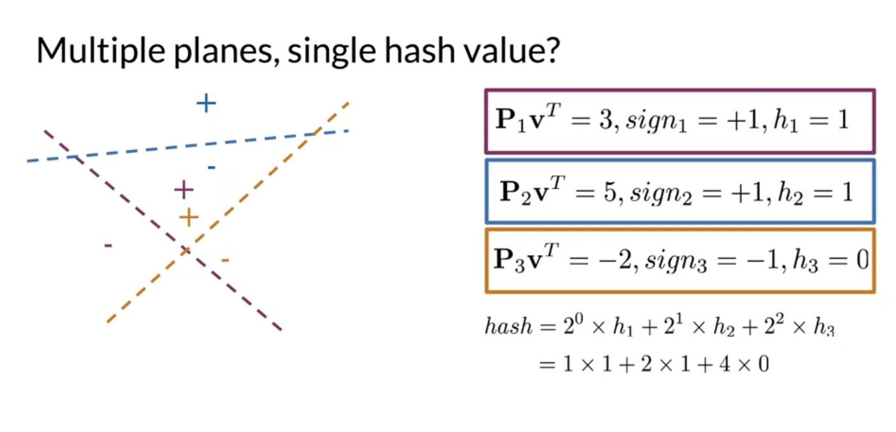
  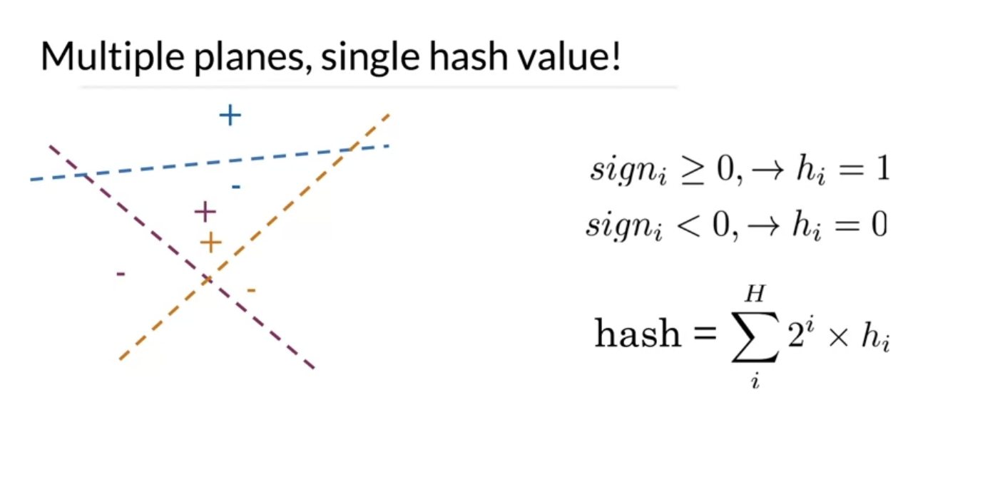

- Implementation

  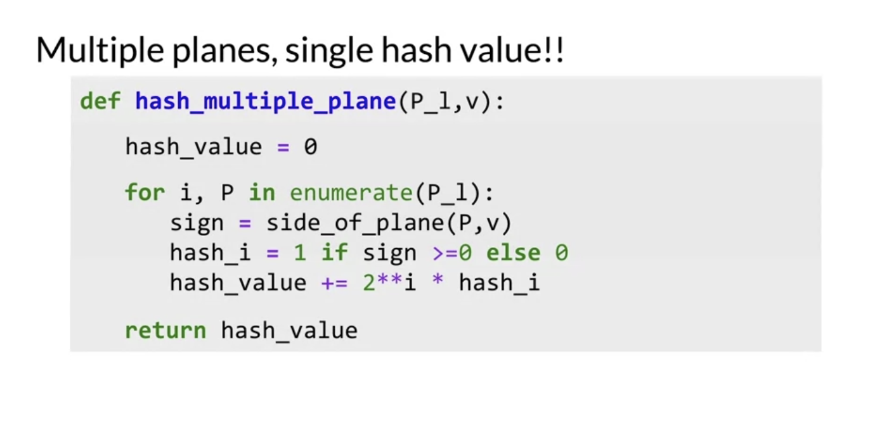

## 2.5 Approximate Nearest Neighbor

- A set of random planes

  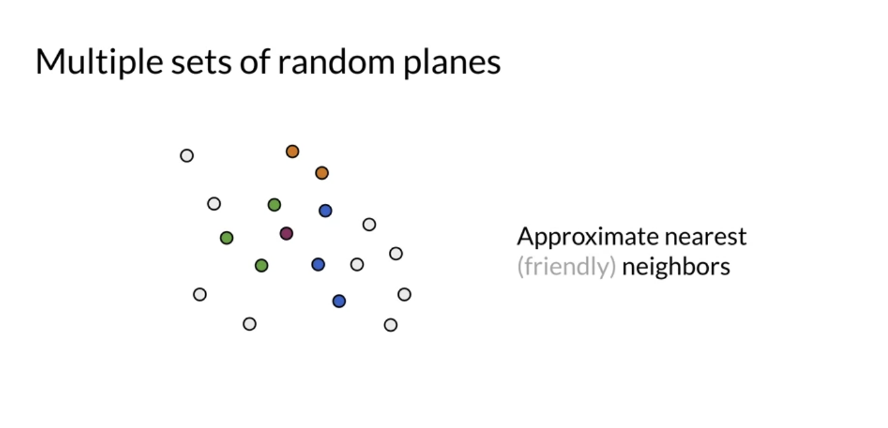

- Implementation

  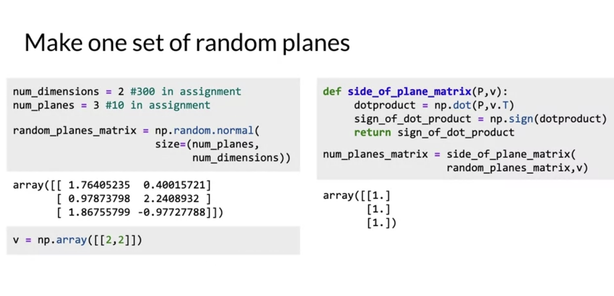

