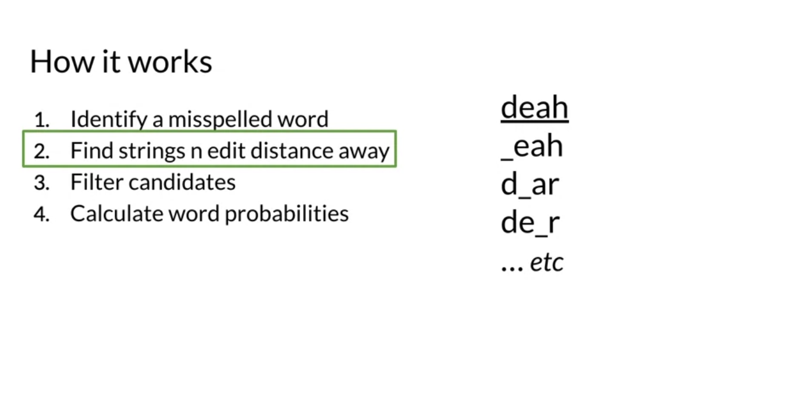
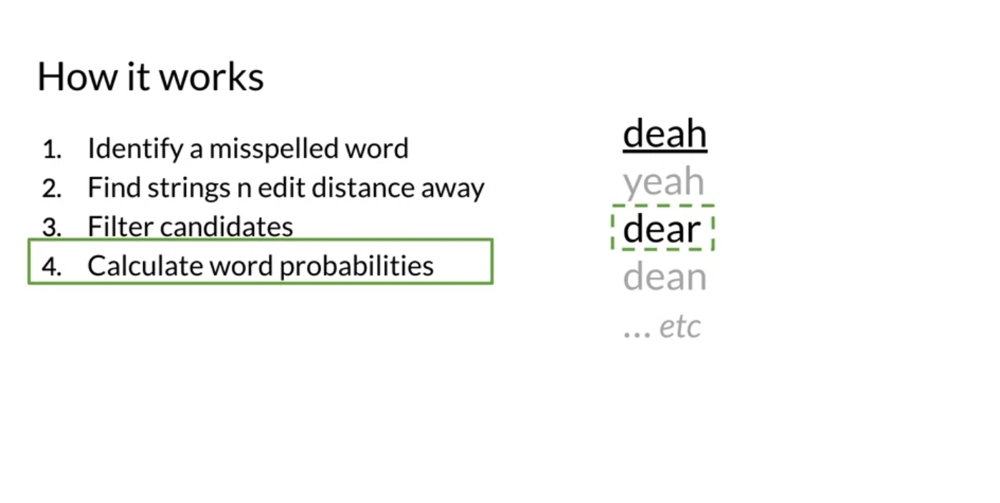
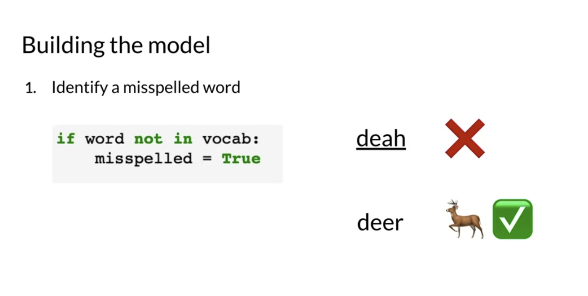
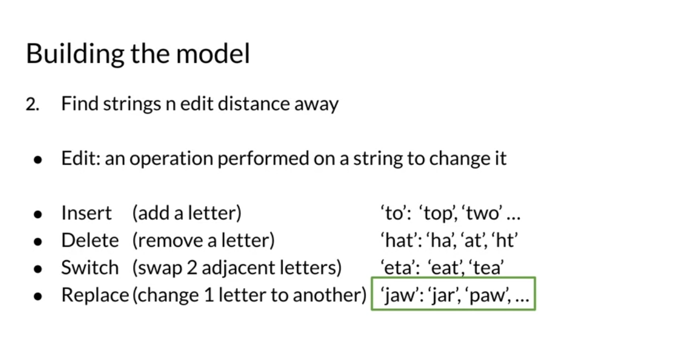
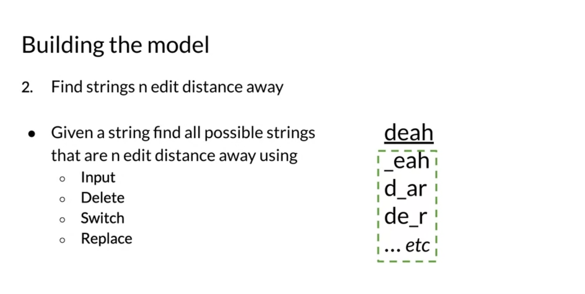
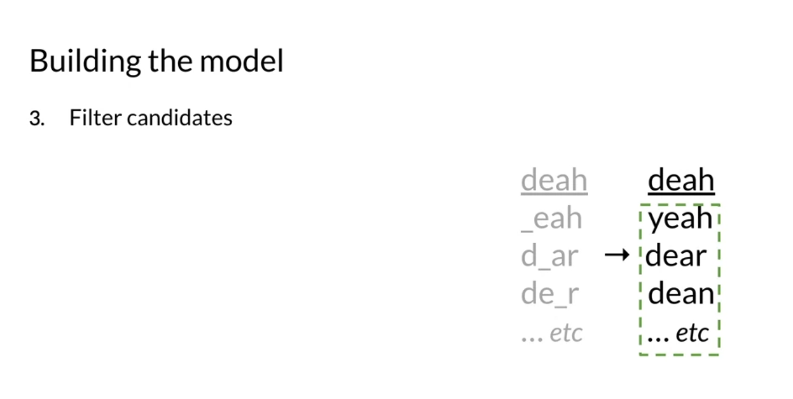

# Week 1

# 1 Autocorrect

## 1.1 Introduction

- Workflow

  
  

## 1.2 Building The Model

1. Identify a misspelled word

  

2. Find strings n edit distance away (n usually be 1~3 in autocorrect)

  
  

3. Filter candidates (if candidates are not in the dictionary, drop them and finally we will get a list of avaliable candidates)

  

4.
