# Week3

# 1 N-Grams

## 1.1 Backgrounds

- Language models / autocompletion

  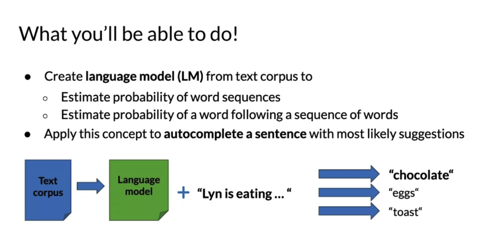
  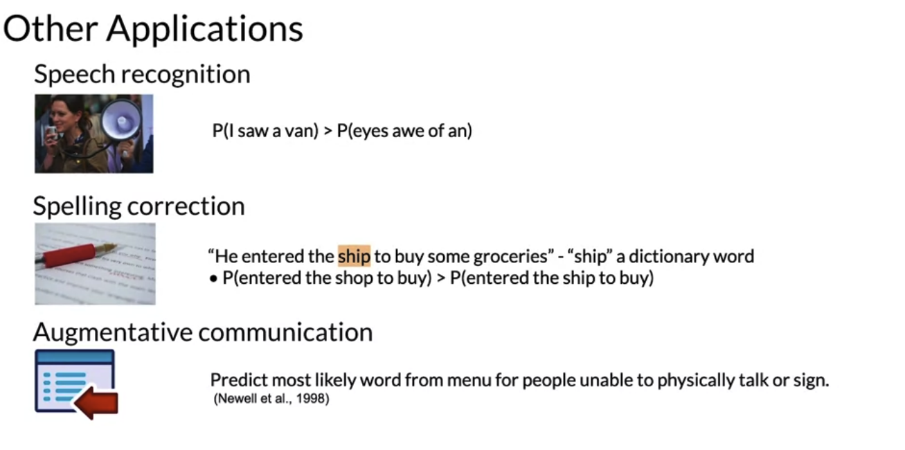

## 1.2 Introduction

  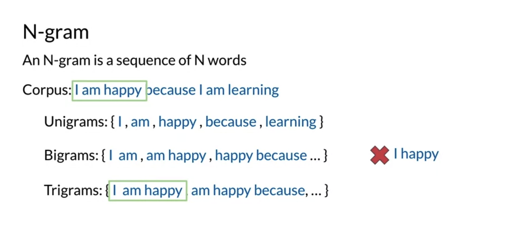
  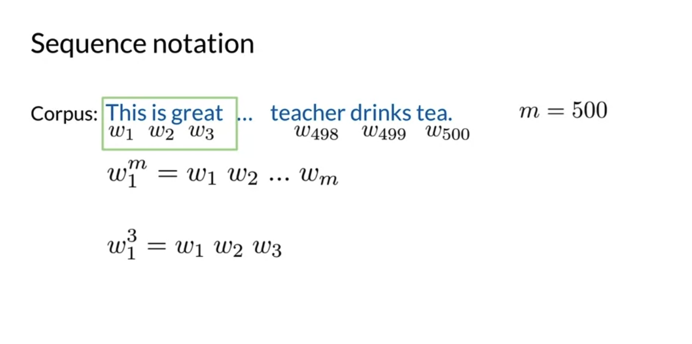

- Probability of unigram

  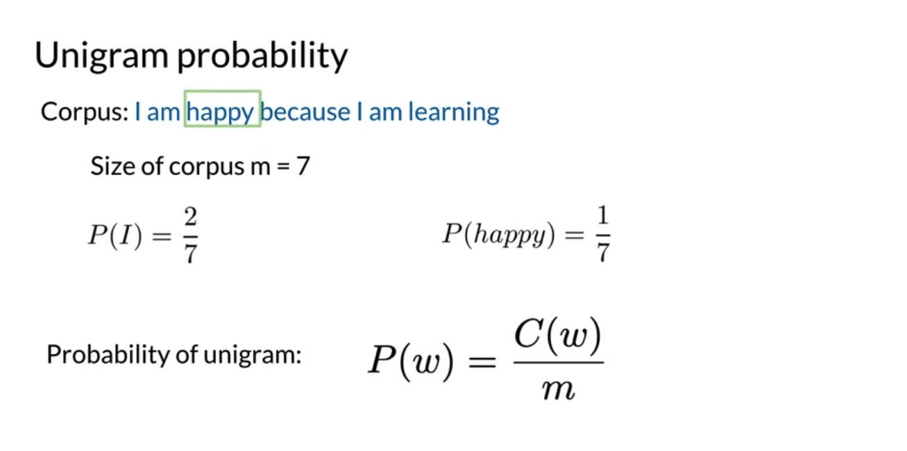

- Probability of bigram / trigram

  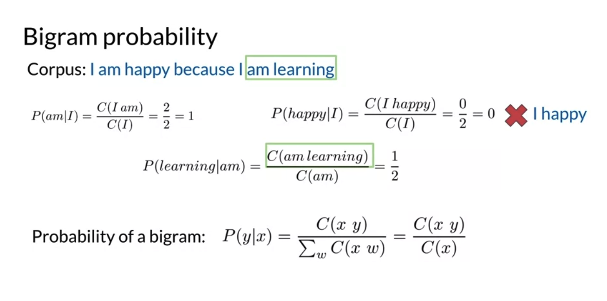
  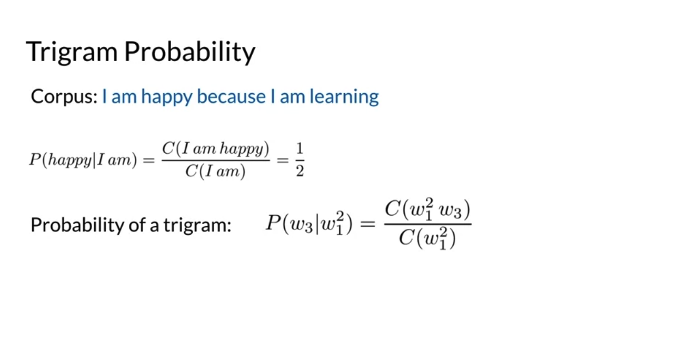

- Probability of ngram

  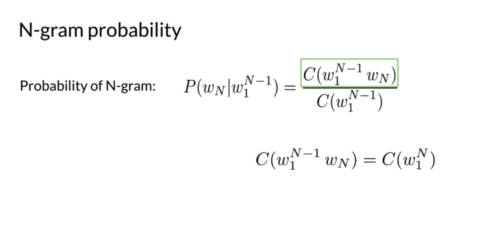

## 1.3 Sequence Probabilities

- Formula

  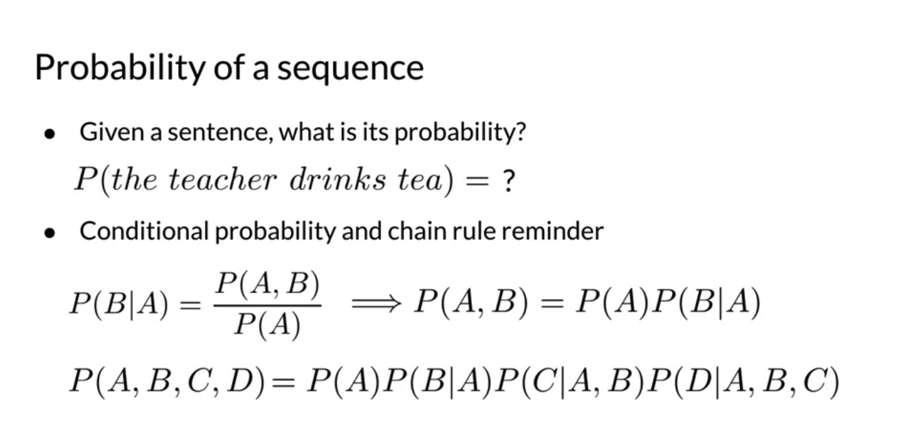

- Example

  
  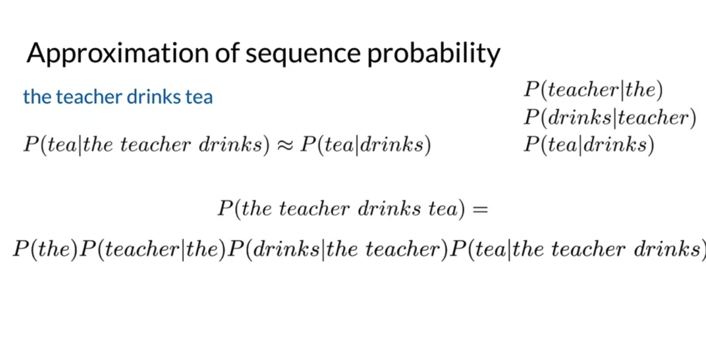

- Approximation

  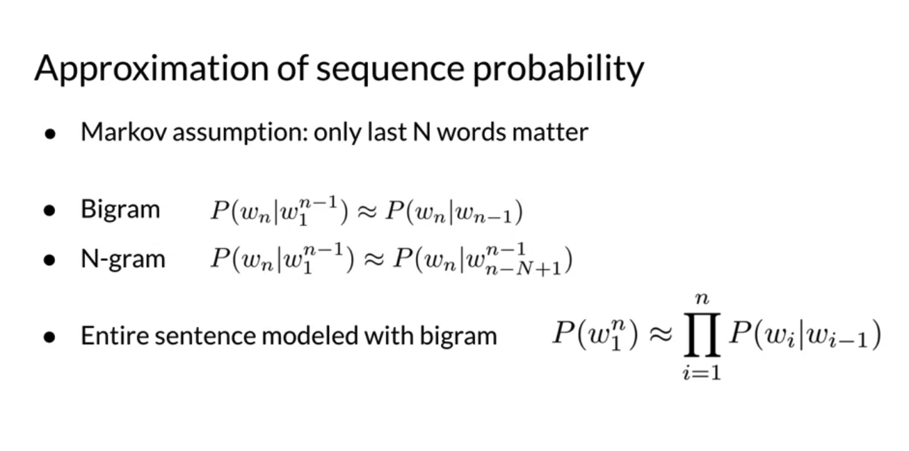

## 1.4 Starting and Ending Sentences

- Start

  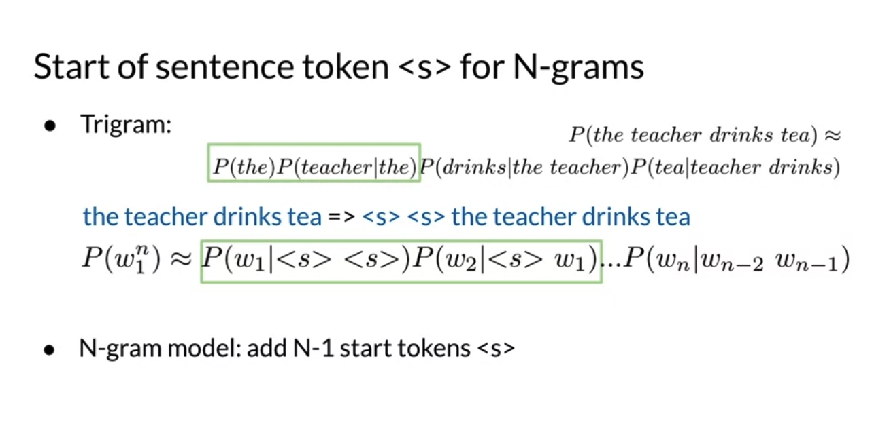

- End

  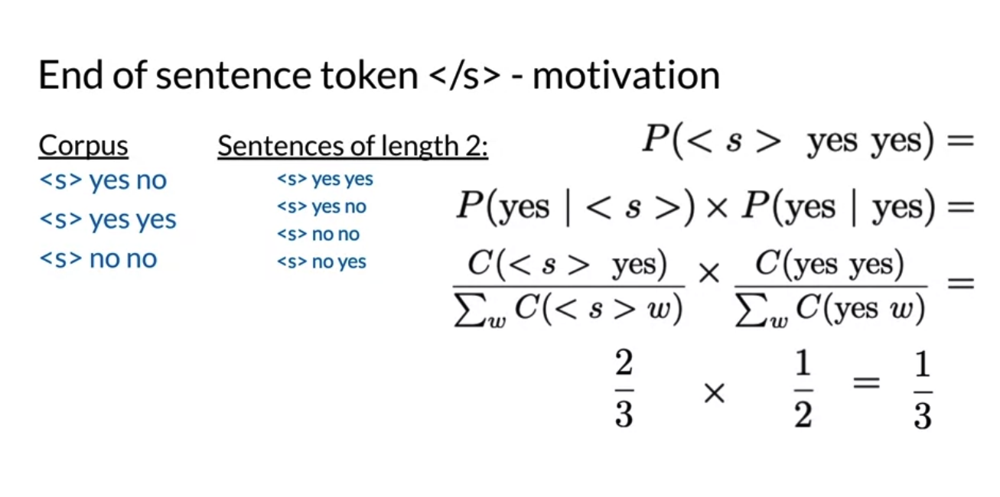
  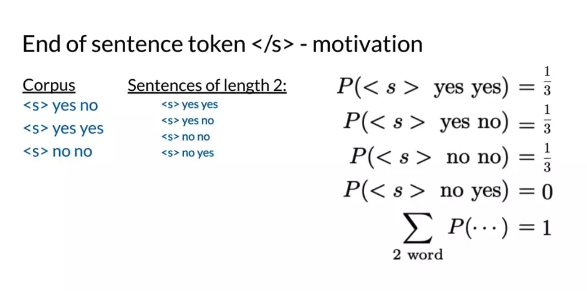

  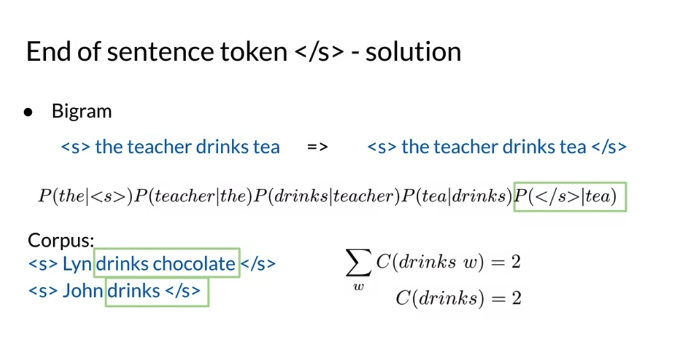
  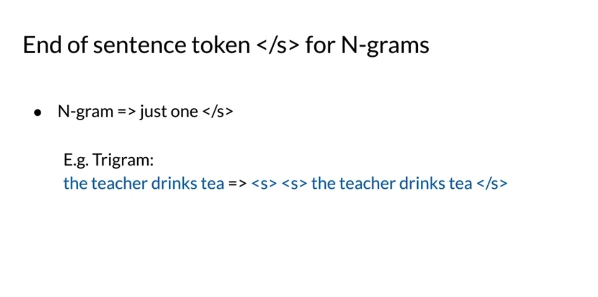

- Example

  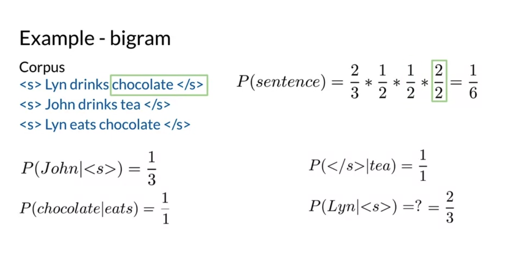

