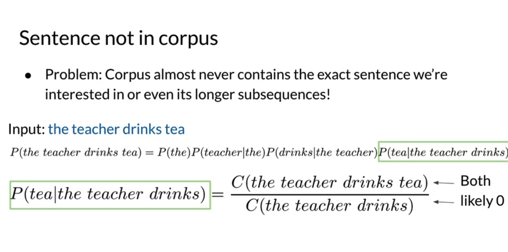
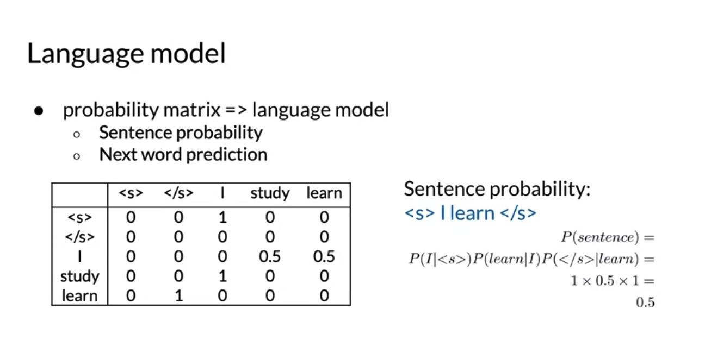
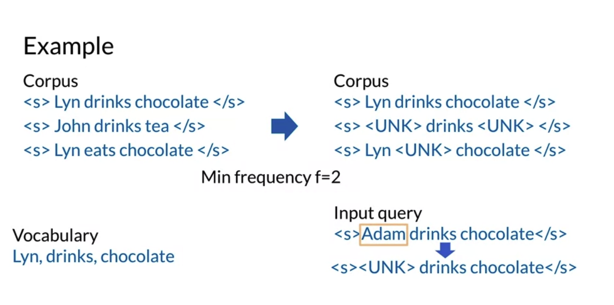

# Week3

# 1 N-Grams

## 1.1 Backgrounds

- Language models / autocompletion

  
  

## 1.2 Introduction

  
  

- Probability of unigram

  

- Probability of bigram / trigram

  
  

- Probability of ngram

  

## 1.3 Sequence Probabilities

- Formula

  

- Example

  
  

- Approximation

  

## 1.4 Starting and Ending Sentences

- Start

  

- End

  
  

  
  

- Example

  

# 2 N-gram Language Model

## 2.1 Introduction

  

## 2.2 Count Matrix

  

## 2.3 Probability Matrix

  

## 2.4 Language Model

  

- Implementation

  
  

## 2.5 Evaluation

- Data

  
  

- Perplexity

  
  

- Bigram perplexity / log perplexity: Good model -> 20~60, 4.3~5.9 (log level)

  
  

## 2.6 Out of Vocabulary Words

  
  

- Example

  

- How to create vocabulary V

  

## 2.7 Smoothing

- Motivation

  

- Smoothing method

  
  

  

