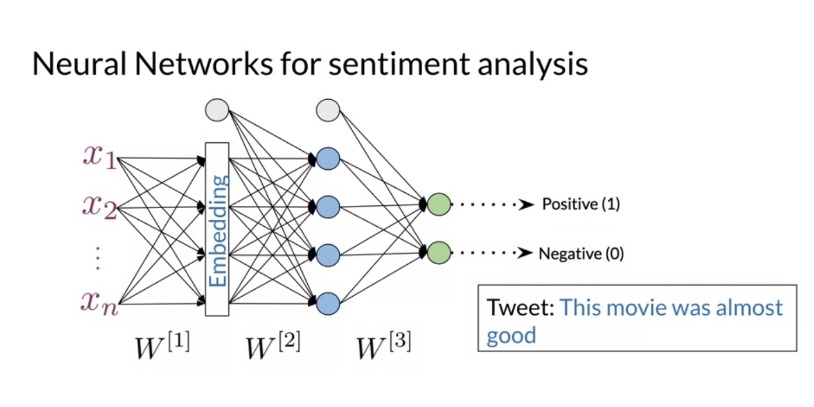
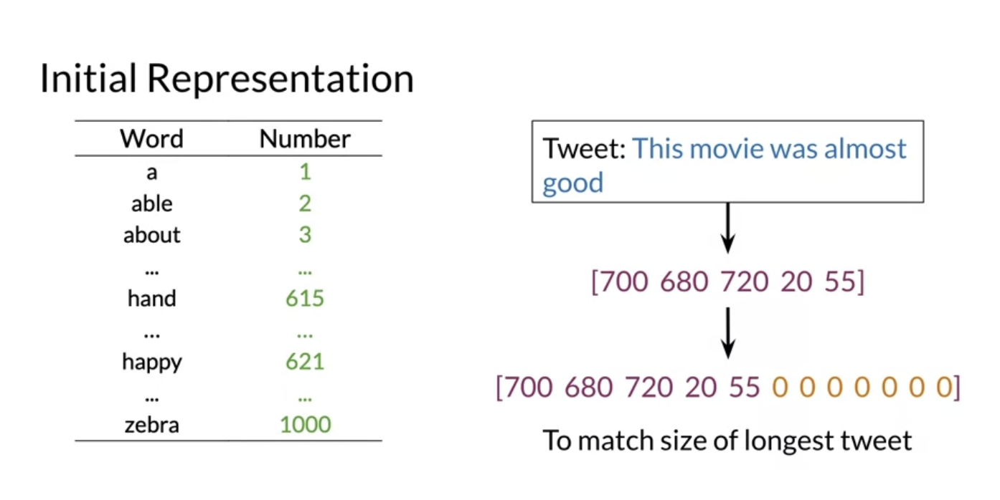
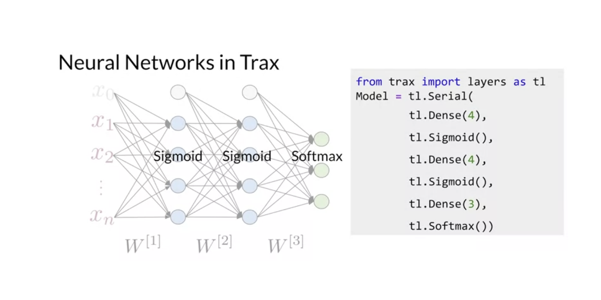
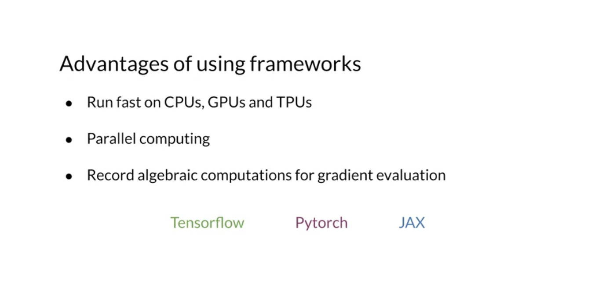

# Week 1

# 1 Neural Network for Sentiment Analysis

## 1.1 Introduction

- Model structure / initail representation (padding - if no enough dimensions, fill with zeros)

  
  

## 1.2 Trax

### 1.2.1 Introduction

- Example

  

- Advantages (Trax is built on TF)

  

### 1.2.2 Why Trax?
