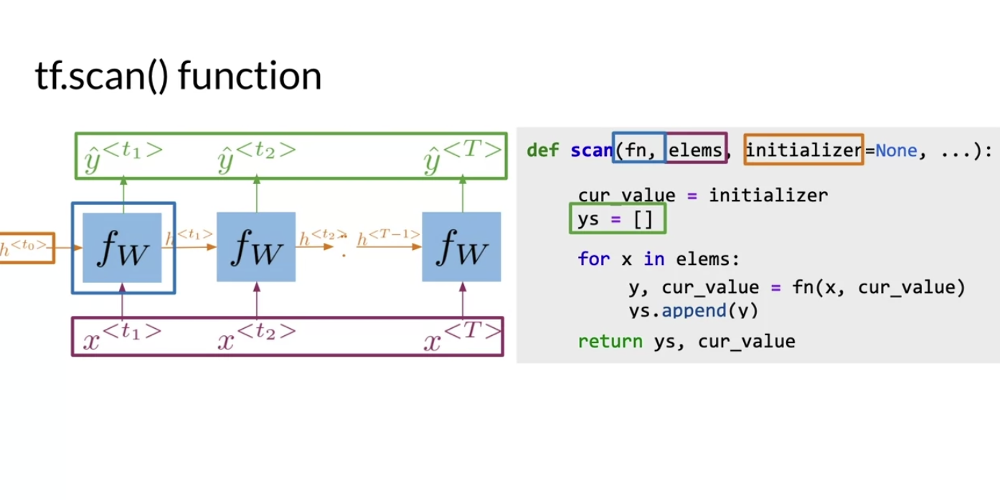
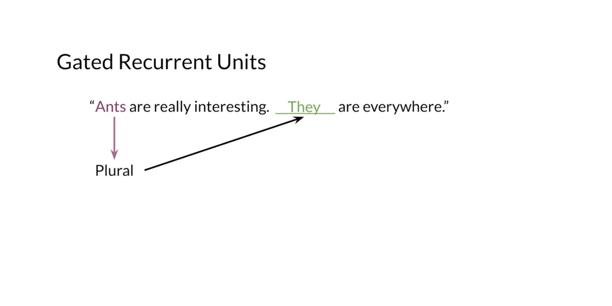
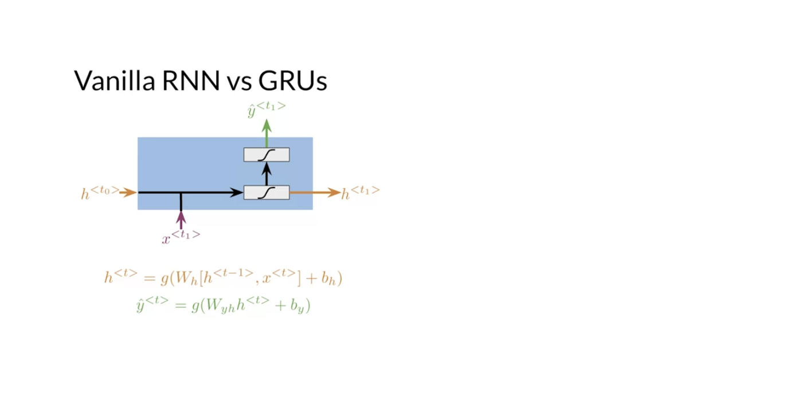
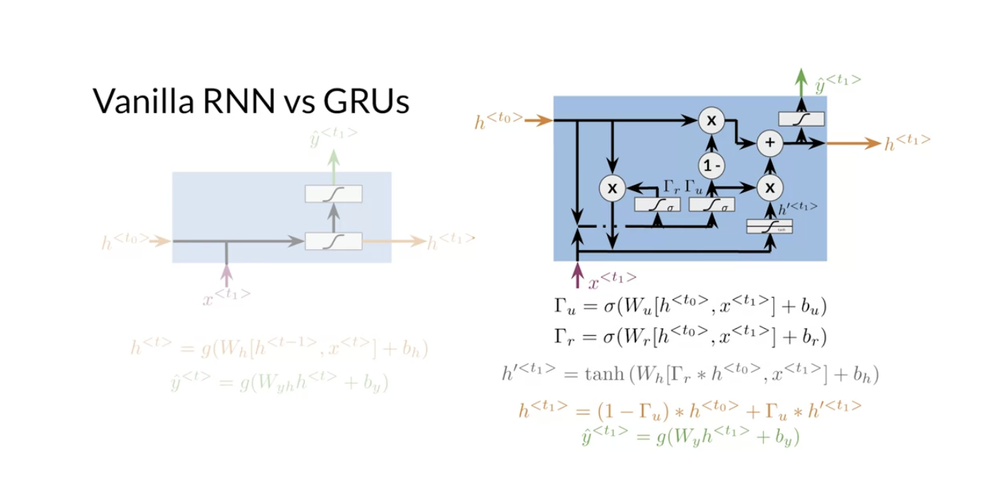
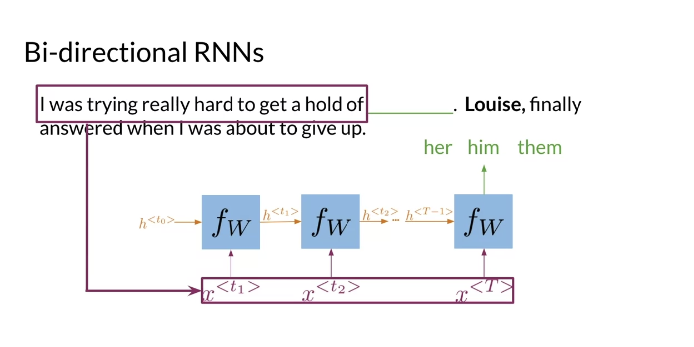
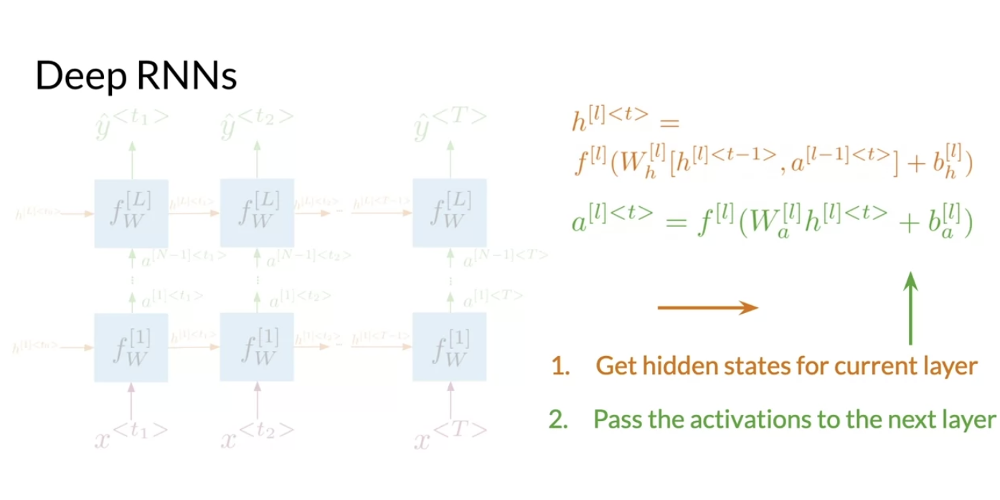

# Week 2

# 1 Recap

  
  

# 2 RNNs

## 2.1 Introduction

- RNNs model relationships among distinct words
- In RNNs, lots of computations share parameters

  
  

## 2.2 Applications of RNN

- One-to-one (use one data to generate one outcome -> not useful)

  

- One-to-many (use one picture to generate multiple results)

  

- Many-to-one (a sequence of words to generate one outcome)

  

- Many-to-many (a sequence of words to generate a sequence of words (machine translation))

  

## 2.3 Math in RNN

- Vanilla RNN
  - Hidden states propagate information through time
  - Basic recurrent units have two inputs at each time: h^<t-1>, x^<t>

  
  

  

## 2.4 Cost Function for RNNs

  
  

## 2.5 Implementation Note

- For loop -> but framework needs this kind of abstraction
- tf.scan() mimics RNNs

  

## 2.6 Gated Recurrent Units (GRU)

- Introduction

  

- Comparison

  
  

## 2.7 Deep and Bidirectional RNNs

- Bidirectional RNNs (starts propagation from both sides)

  
  

- Deep RNNs (multiple RNNs (can be more than one))

  
  

