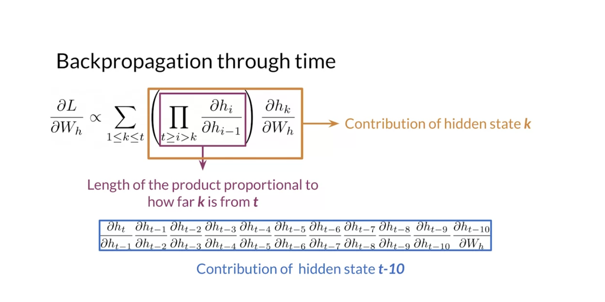
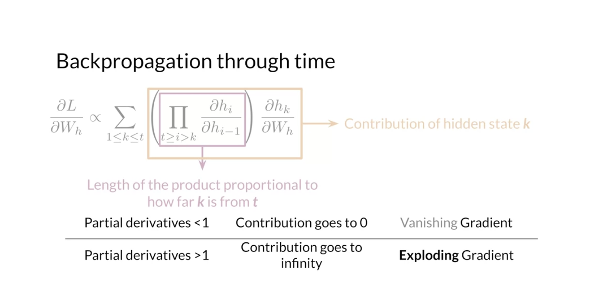
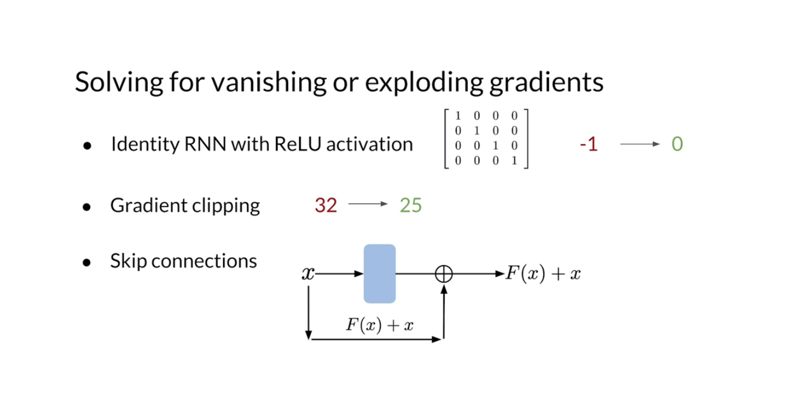
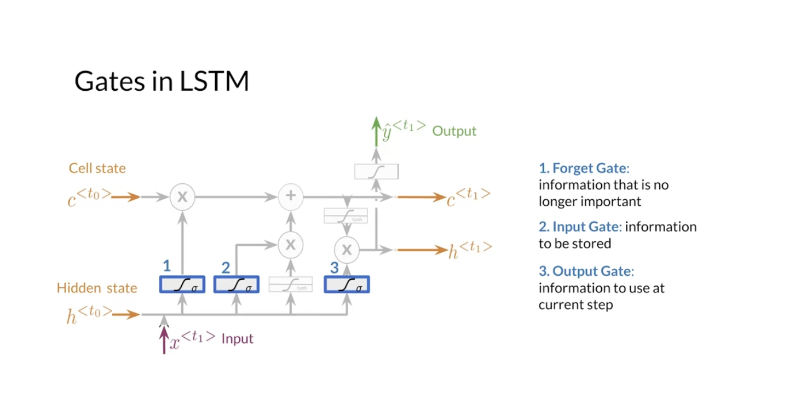
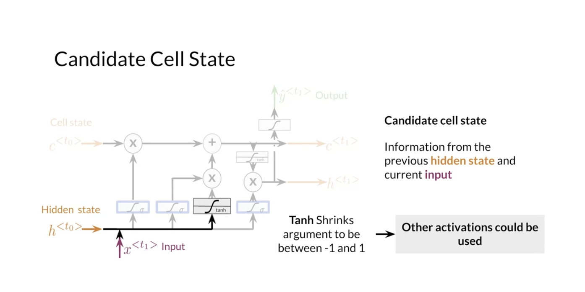
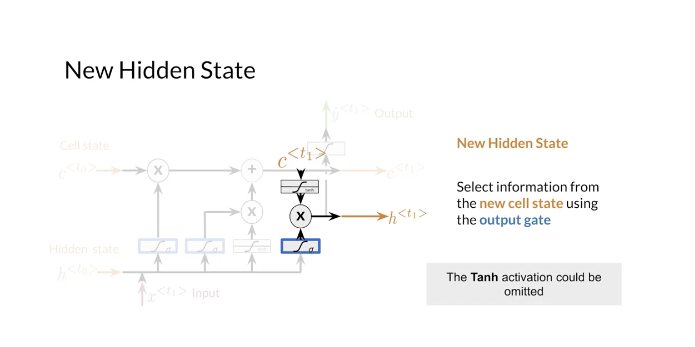

# Week3

# 1 RNNs and Vanishing Gradients

## 1.1 Recap for RNNs

- Advantages
  - Captures dependencies within a short range
  - Takes up less RAM than other n-gram models
- Disadvantages
  - Struggles to capture long term dependencies
  - Prone to vanishing or exploding gradients

## 1.2 Vanishing Gradients & Exploding Gradients

- Gradient is proportional to a sum of partial derivative products
- Vanishing gradients: let RNN ignore the parameters computed from early steps
- Exploding gradients: lead to convergence problems during training

  
  

- Solving for vanishing or exploding graidents

  

# 2 LSTMs

## 2.1 Introduction

1. Forget gate
2. Input gate
3. Output gate

  

- Applications

  

## 2.2 Architecture

- Candidate cell state
- New cell state

  
  

