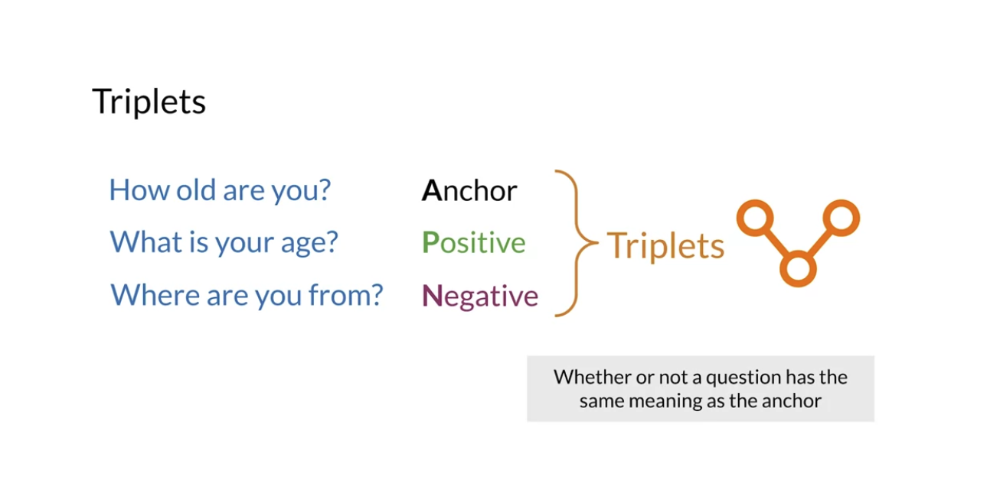

# Week 4

# 1 Siamese Networks

## 1.1 Introduction

- Question similarity

  
  

- Applications

  

## 1.2 Architecture

  

## 1.3 Cost Function

- Loss function (minimizing loss, minimizing difference)

  
  

## 1.4 Triplets

- Introduction to triplets

  
  

- Triplet loss

  
  

