# Week 1

# 1 Neural Network for Sentiment Analysis

## 1.1 Introduction

- Model structure / initail representation (padding - if no enough dimensions, fill with zeros)

  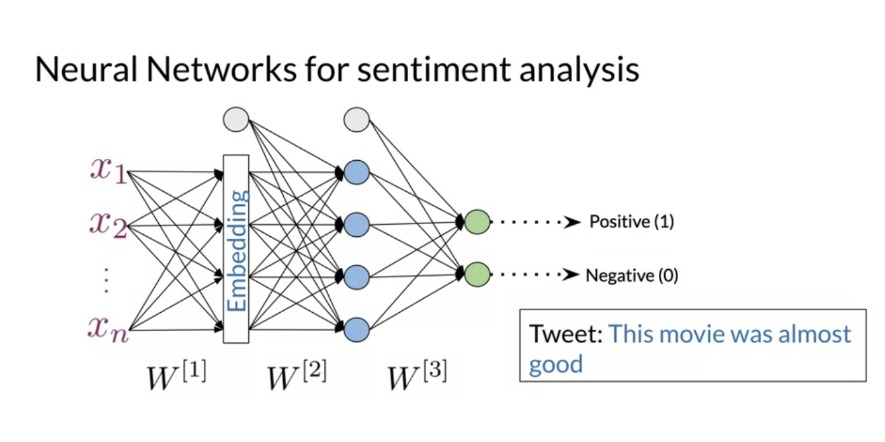
  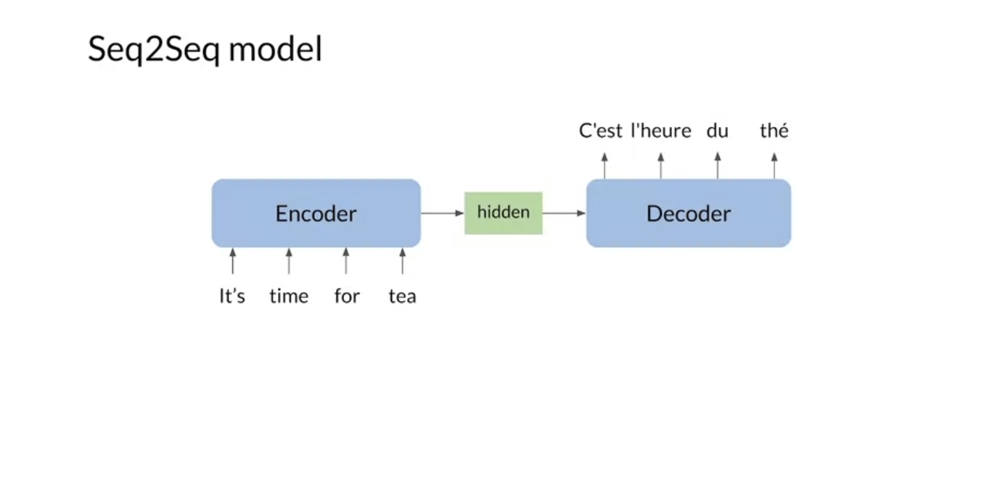

## 1.2 Trax

### 1.2.1 Introduction

- Example

  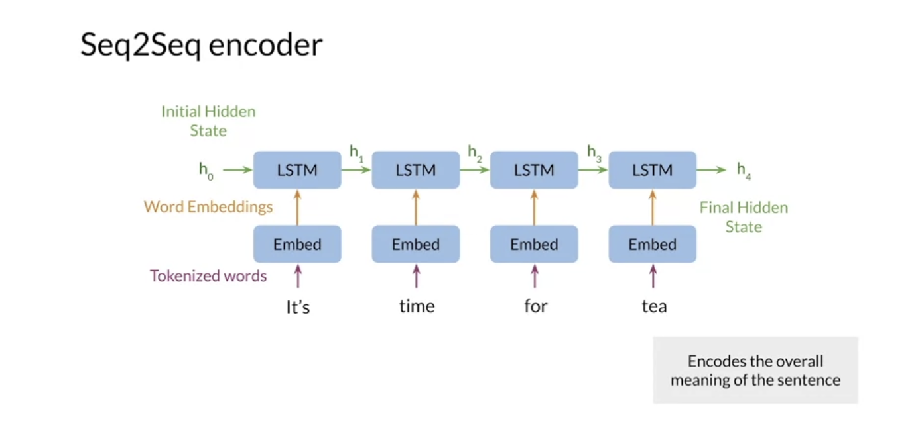

- Advantages (Trax is built on TF)

  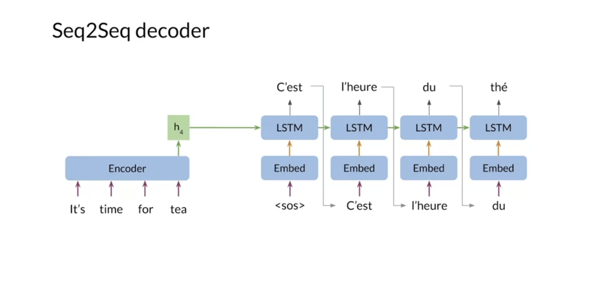

### 1.2.2 Python class

  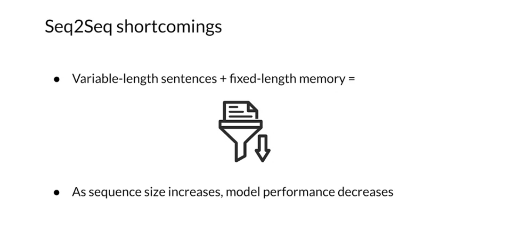

### 1.2.3 Dense layer and ReLU layer

  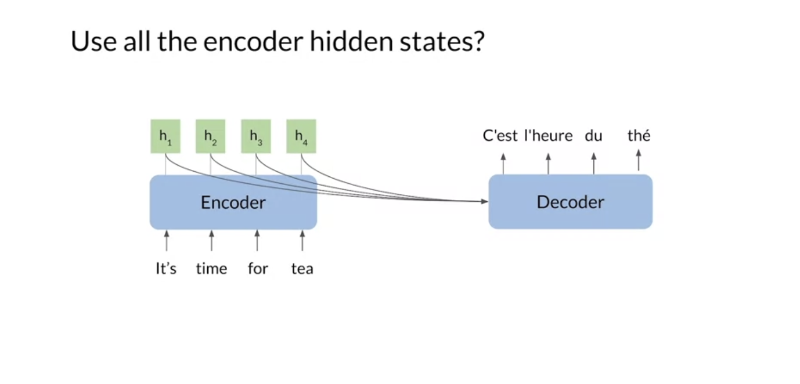
  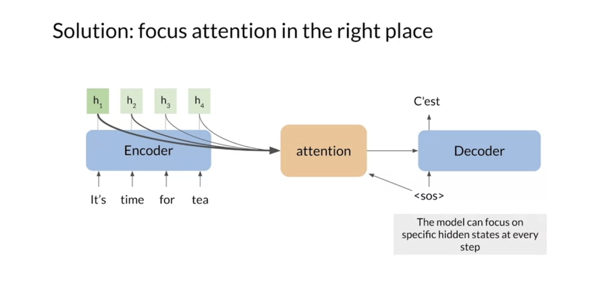

### 1.2.4 Serial layer

  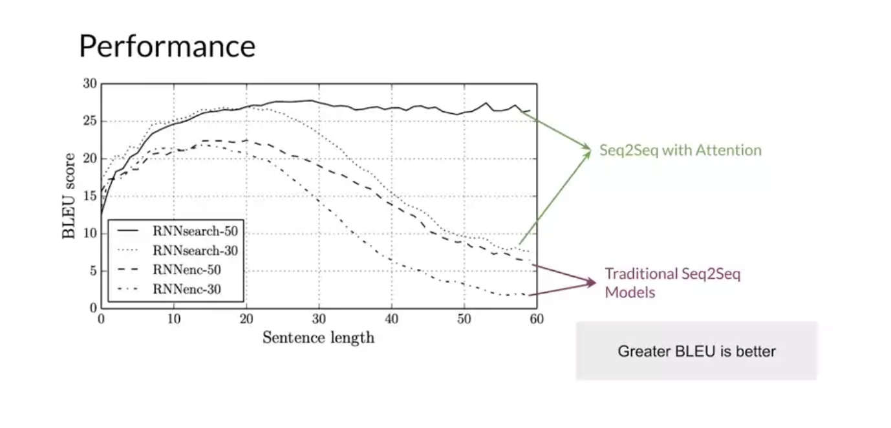

### 1.2.5 Other layers

- Embedding layer

  

- Mean layer (no trainable parameters)

  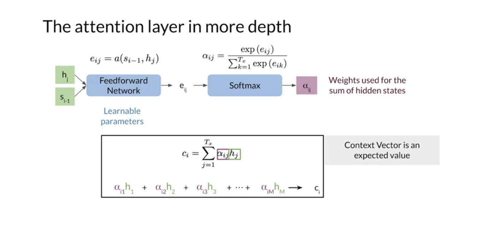

## 1.3 Training

  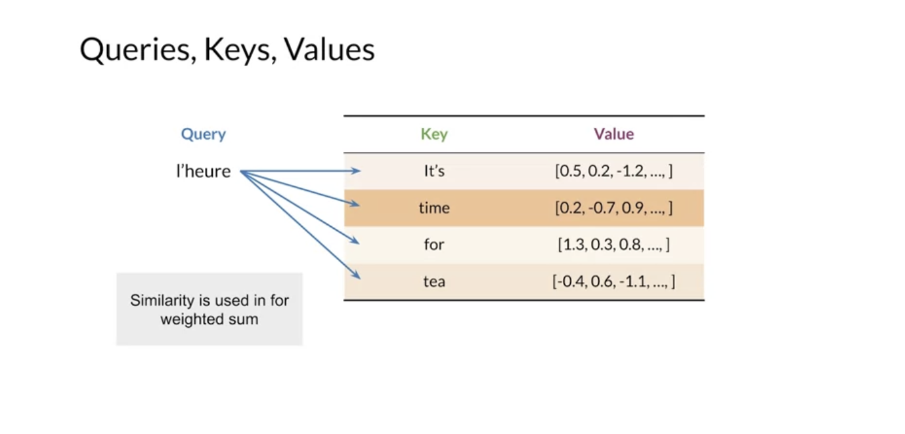
  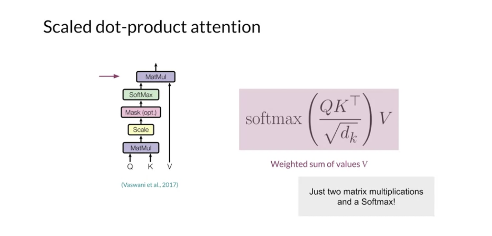

