# Week 1

# 1 Seq2seq

- Introduction

  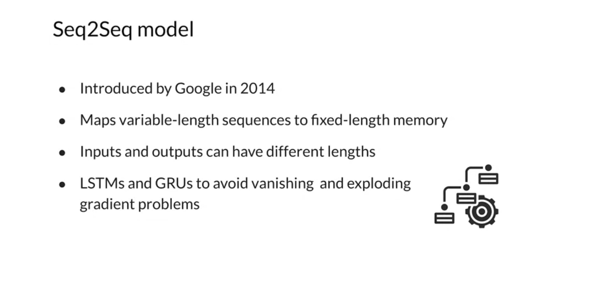
  

- Encoder & decoder

  
  

- Short comings

  

- Time efficiency - attention
  - Model would have flaws with memory and contexts
  - Provide information specific to each input word, you can give the model a way to focus it's attention in the right place at each step of the decoding process

  
  

# 2 Seq2seq Model with Attention

- Comparison

  

- Motivation

  
  

# 3 Queries, Keys, Values, and Attention

- Introduction

  

- Scaled dot product attention

  

- Alignment weights & flexible attention

  

# 4 Machine Translation

## 4.1 Setup

- Data

  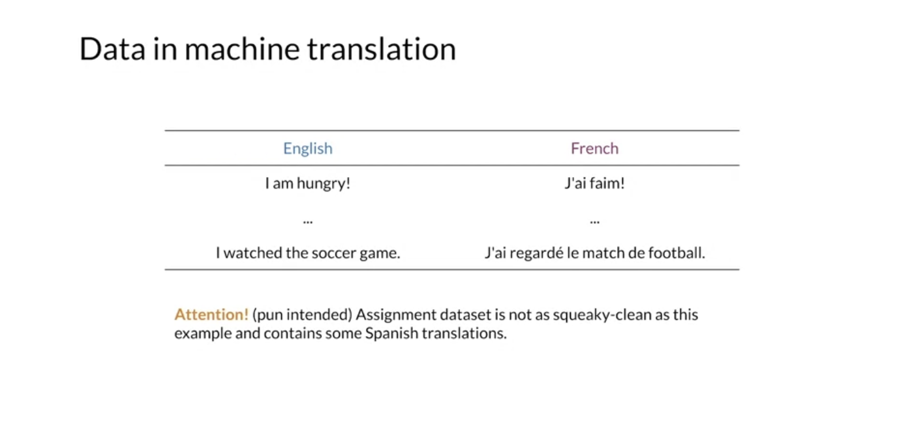
  

- Example

  
  

## 4.2 Teach Forcing

- The model is naive during early steps of training

  
  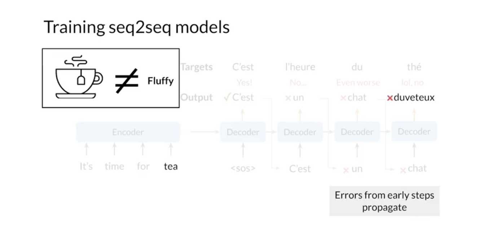

- Correct sequence (ground truth) of words as input (shifted right)
  - It has some variations. For example, you can slowly start using decoder outputs over time, so that leads into training, your are no longer feeding in the target words (curriculum learning)

  

## 4.3 NMT (Neural Machine Translation) Model with Attention

- Model structure

  
  

- NMT model

  

## 4.4 Evaluation

### 4.4.1 BLEU score

- Introduction

  

- Basic version
  - Con: more common words, better performance

  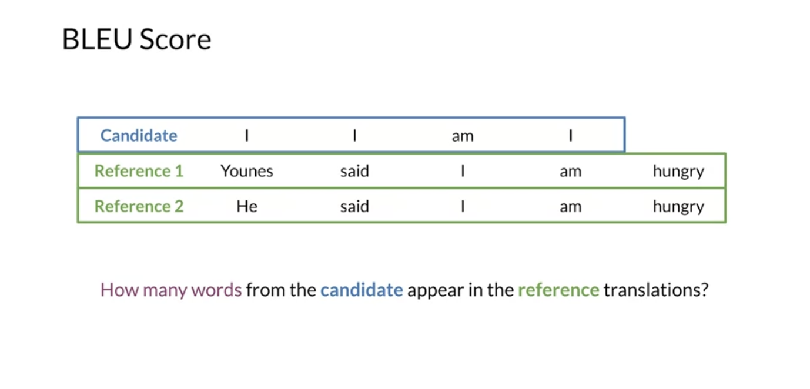
  

- Modified version

  

- Drawbacks

  

### 4.4.2 ROUGE

- Introduction

  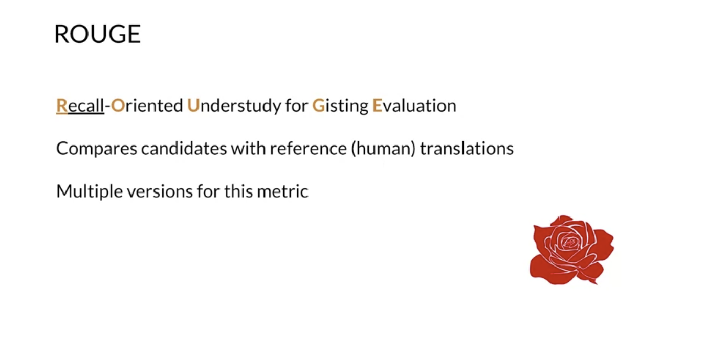

- Basic version

  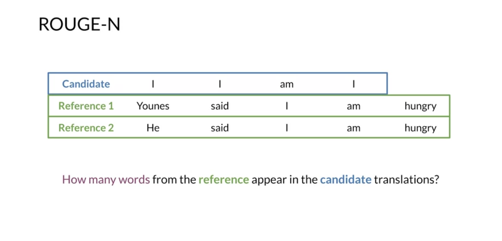
  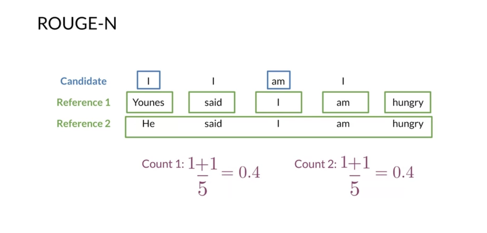

- Combined version: ROUGE-N, BLEU, and F1 score

  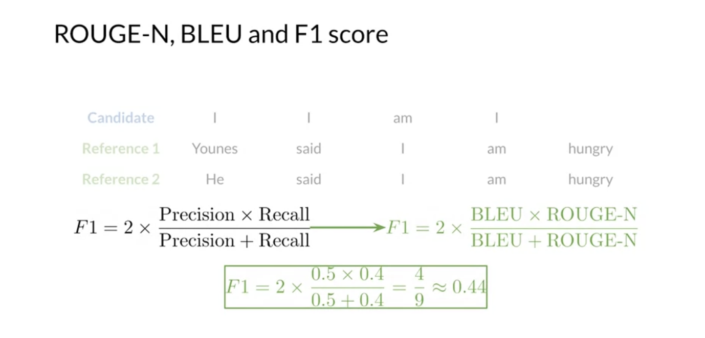

- Note
  - All these evaluation metrics don't consider the sentence structure and semantics
  - Only account for matching n-grams (accuracy) between candidates and the reference translations

## 4.5 Sampling and Decoding

### 4.5.1 General method

- Greedy decoding

  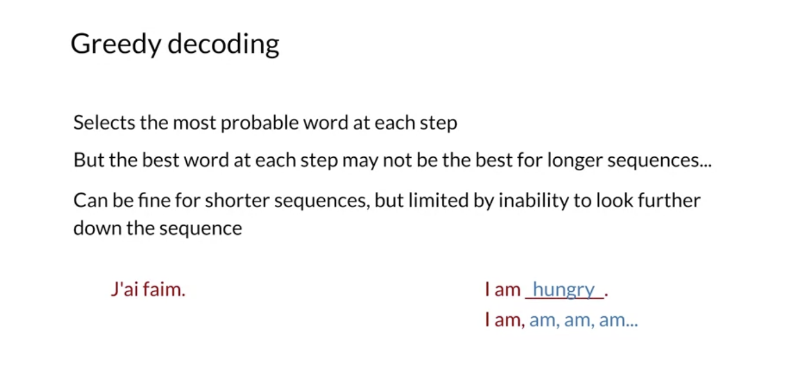

- Random sampling

  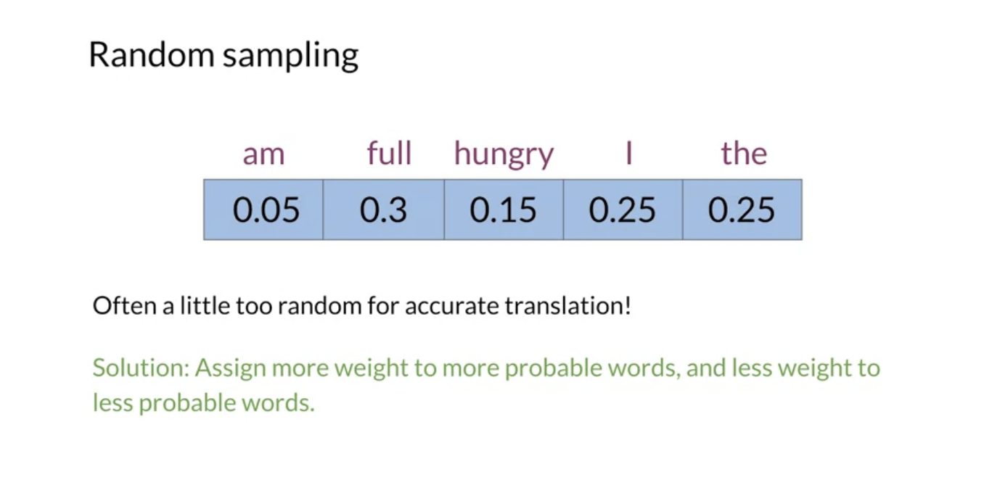
  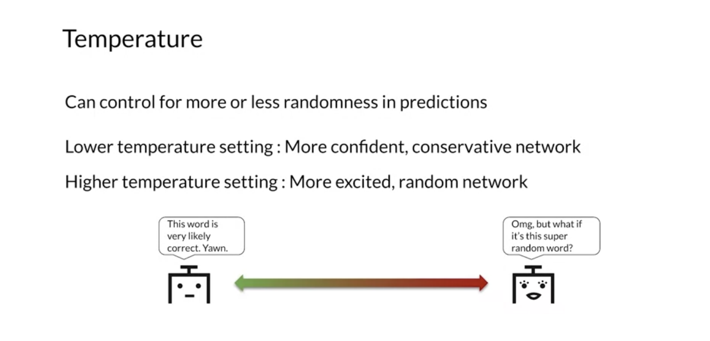

### 4.5.2 Beam Search

- Introduction

  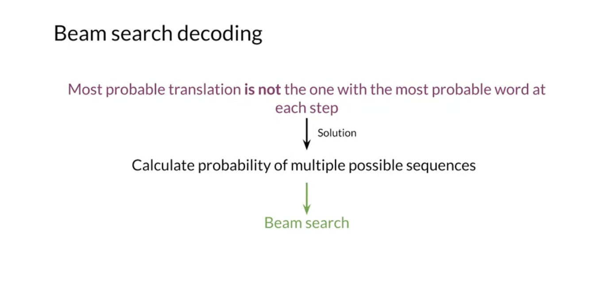
  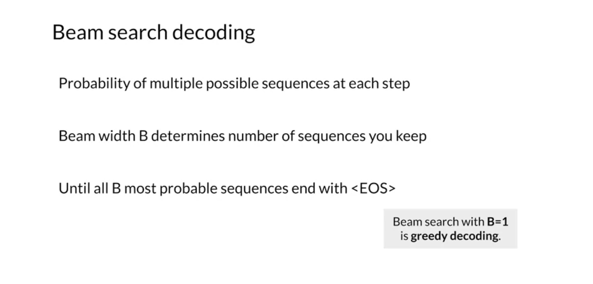

- Example

  

  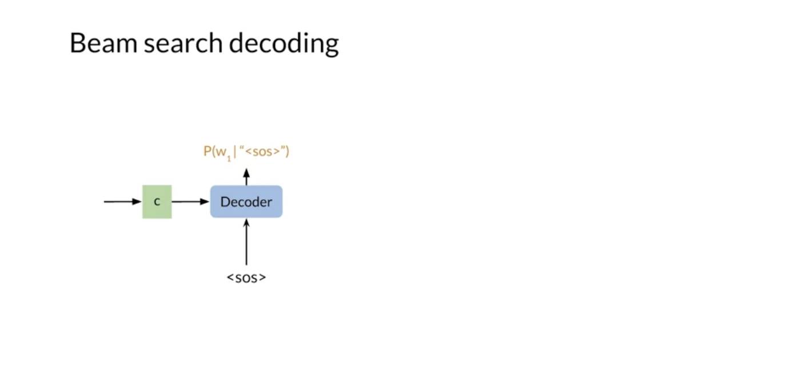
  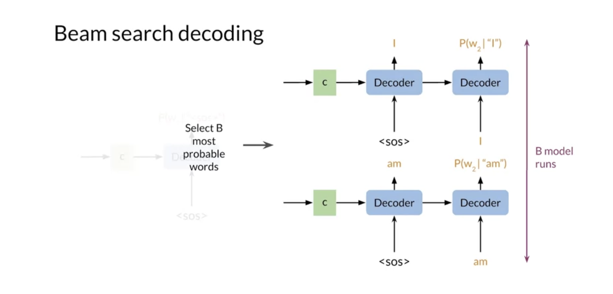

- Problem

  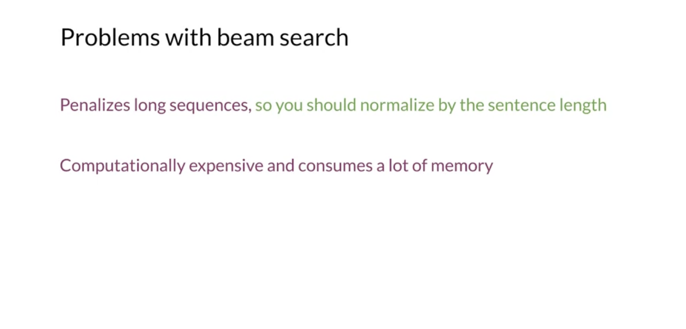

### 4.5.3 Minimum Bayes Risk (MBR)

- Introduction & calculation

  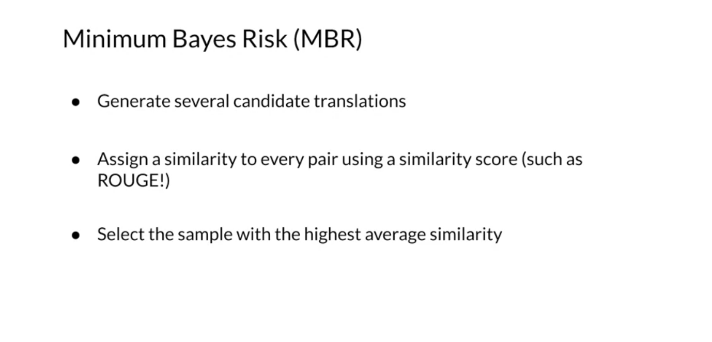
  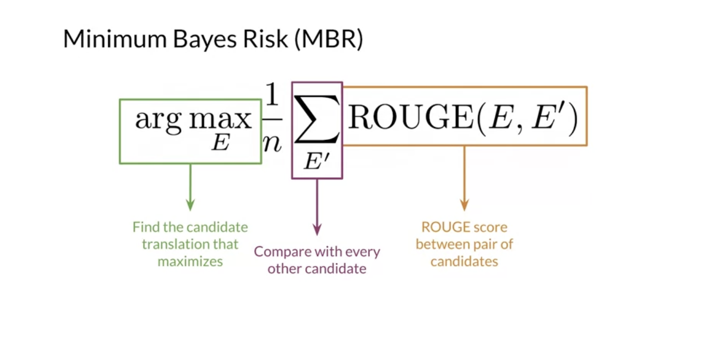

- Example
  - More contextually accurate translation than random sampling and greedy decoding

  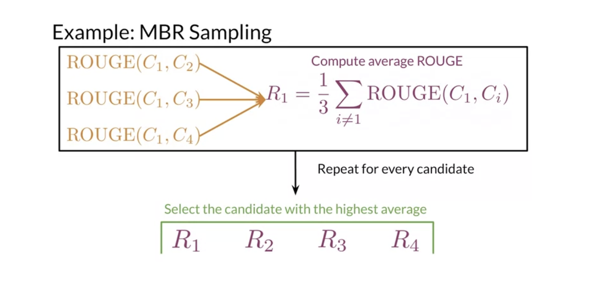

