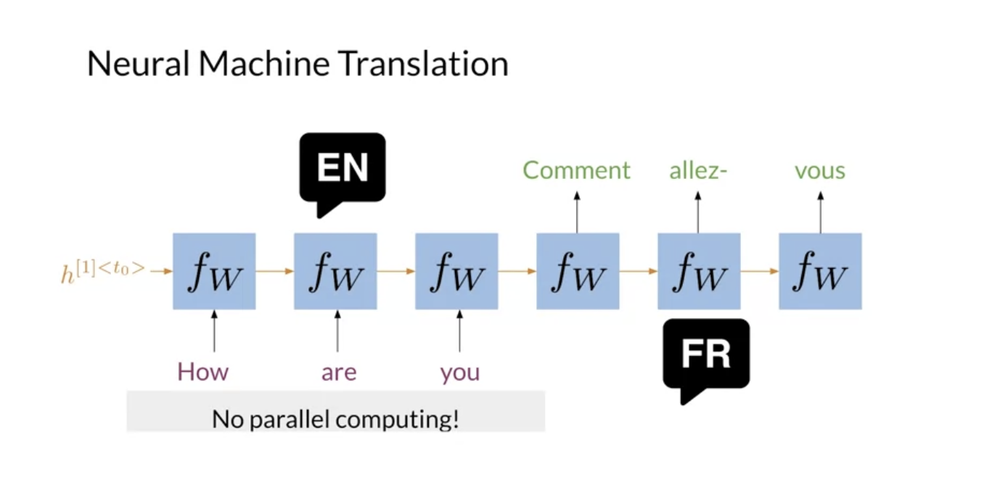
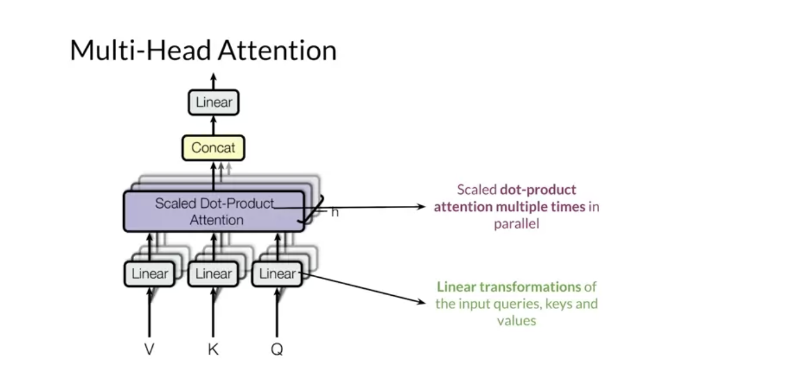

# Week 2

# 1 Transformers vs RNNs

- RNNs -> no parallel computing

  
  

- RNNs vs Transformers

  

# 2 Transformers

## 2.1 Overview

- Multi-head attention model

  

- The encoder & decoder

  
  

- Positional encoding

  

- The transformer

  

- Summary

  

## 2.2 Applications

- Applications

  

- NLP models

  

- Breif introduction of T5 (a multi-task transformer)

  
  

## 2.3 Scaled Dot Product Attention

- Recap

  

- Queries, keys, and values

  

- Attention Math

  

