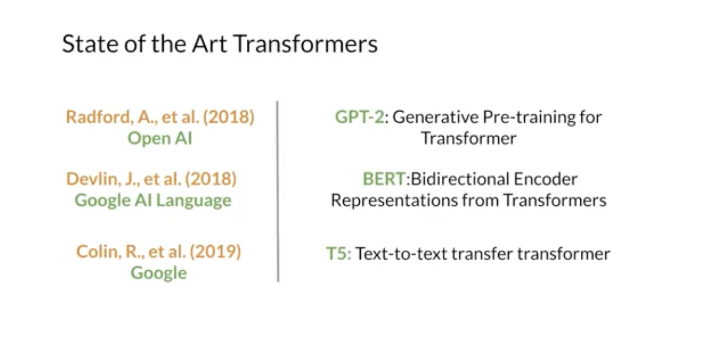
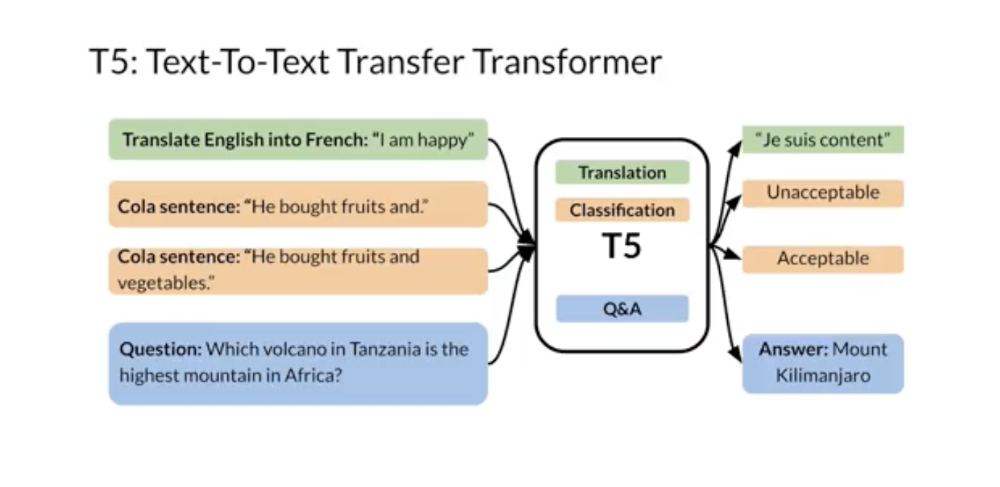
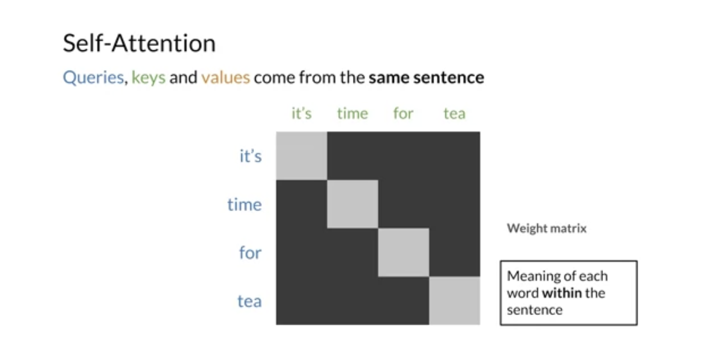
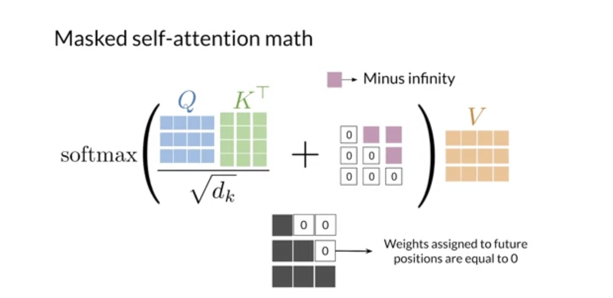
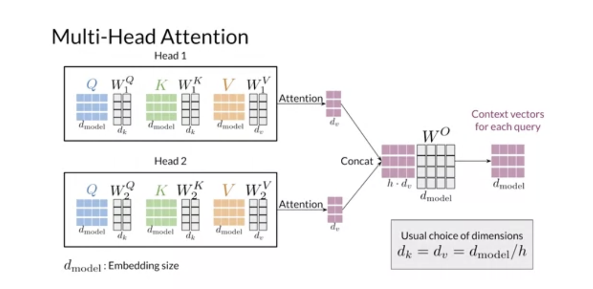
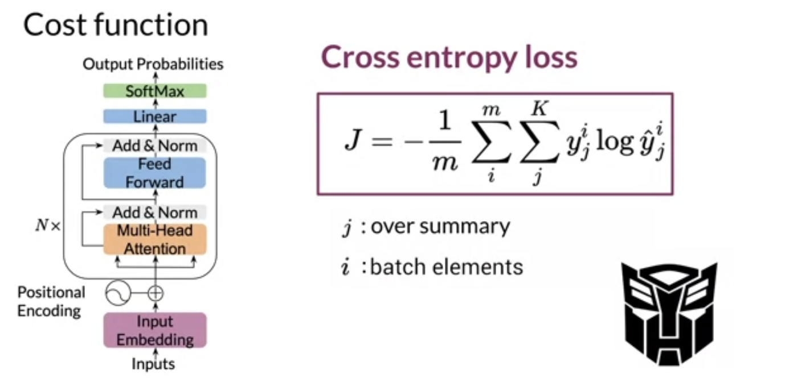

# Week 2

# 1 Transformers vs RNNs

- RNNs -> no parallel computing

  
  

- RNNs vs Transformers

  

# 2 Transformers

## 2.1 Overview

- Multi-head attention model

  

- The encoder & decoder

  
  

- Positional encoding

  

- The transformer

  

- Summary

  

## 2.2 Applications

- Applications

  

- NLP models

  

- Breif introduction of T5 (a multi-task transformer)

  
  

# 3 Attention

## 3.1 Scaled Dot Product Attention

- Recap

  

- Queries, keys, and values

  

- Attention Math

  

## 3.2 Masked Self Attention

- Encoder-decoder attention

  

- Self attention

  

- Masked self-attention math

  

## 3.3 Multi-head Attention

- Overview

  
  

- Multi-head attention structure

  

# 4 Transformer Decoder

- General

  
  

- Decoder block

  

- Feed forward layer

  

# 5 Transformer Summarizer

- Data processing

  

- Cost Function

  

- Inference

  

