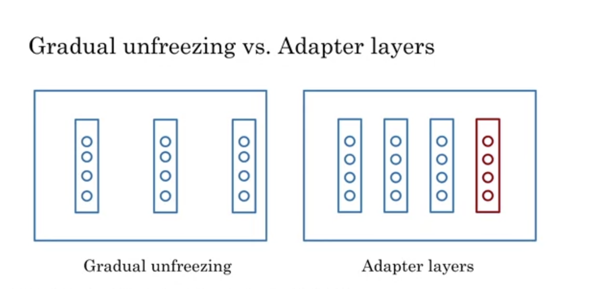

# Week3

# 1 Overview

  

- Question answering
  - Closed book: without accessing other documents

  

- Transfer learning

  

- Classical training vs. transfer learning

  
  

- Transfer learning: different tasks

  

- BERT

  

- T5: single task vs. multi task

  

- Transfer learning: desirable goals

  

# 2 Transfer Learning in NLP

- Process

  

- General purpose learning

  

- Feature-based vs. fine-tuning

  

- Adding new layer
  - Freeze all parameters

  

- Self-supervised task

  
  

- Fine-tune a model for each donwstream task

  

# 3 ELMo, GPT, BERT, T5

- Timeline

  

- CBOW

  
  

- BiLSTM
  - Output the embedding of the target word

  

- GPT
  - Unidirectional (no peeking)!

  

- BERT

  
  

- BERT: Words to Sentences

  
  

- T5

  

- Summary

  

# 4 BERT

## 4.1 Introduction

  
  

- Quick summary

  

## 4.2 BERT Objective

- Formalizing the input

  
  

- Objective

  

## 4.3 Fine-tune Pre-trained

  
  

## 4.4 Transformer: T5

- Tasks

  

- Data

  

- Architecture

  
  

## 4.5 Multi-task Training Strategy

- Performance

  
  

- Data training strategies

  
  

- Fine-tune
  - The main objective of the multitasking training strategy is to improve the performance of the various tasks by learning them together

  

# 5 GLUE Benchmark

  
  

# 6 Question Answering

- Model

  

- Data

  

- Implementation

  

# 7 Hugging Face

## 7.1 Introduction

  
  

- Fine-tune

  

## 7.2 Pipeline

- Tasks

  
  

- Checkpoints

  

- Model hub

  

