# Week 4

# 1 Task with Long Sequences

## 1.1 Introduction

- Tasks (difficult for training)

  

- Chatbot: context windows

  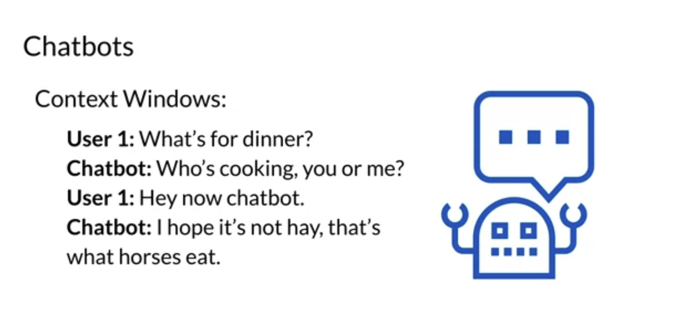

## 1.2 Transformer Issues

- Activations need to be stored for backprop
- Big models are getting bigger

  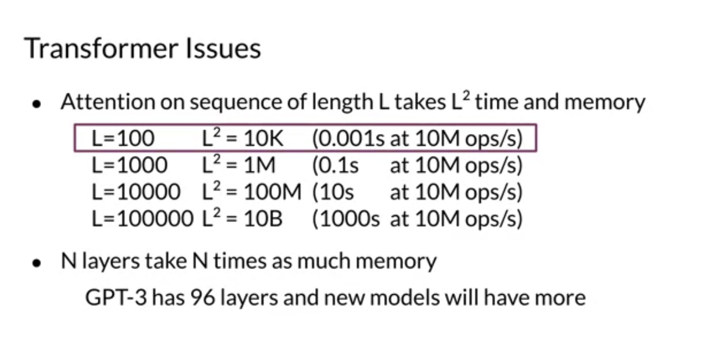
  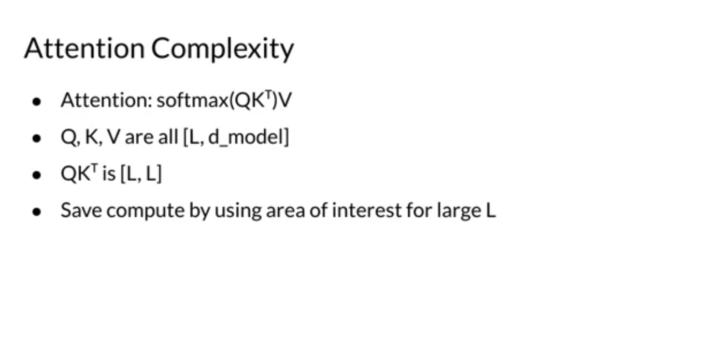

# 2 LSH Attention

## 2.1 Introduction

- What does attention do?
- Nearest neighbors

  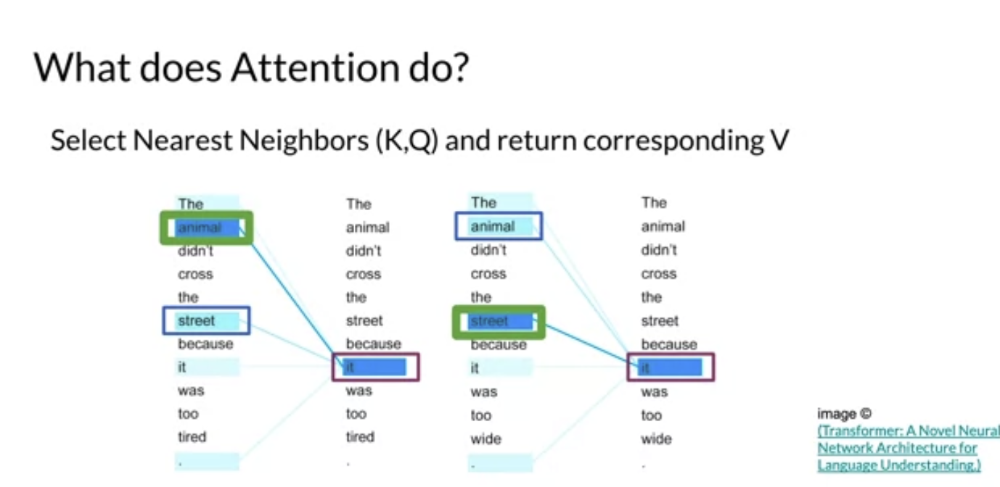
  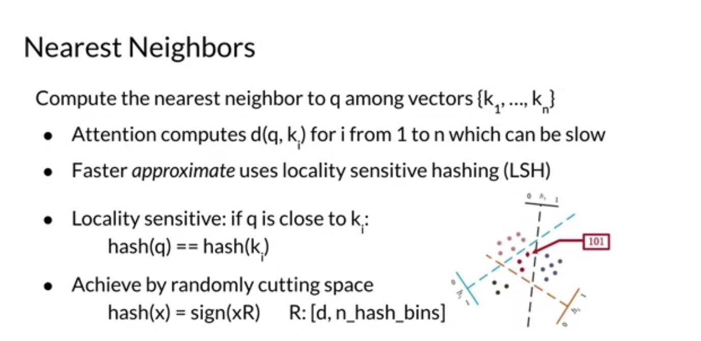

## 2.2 LSH Attenion

  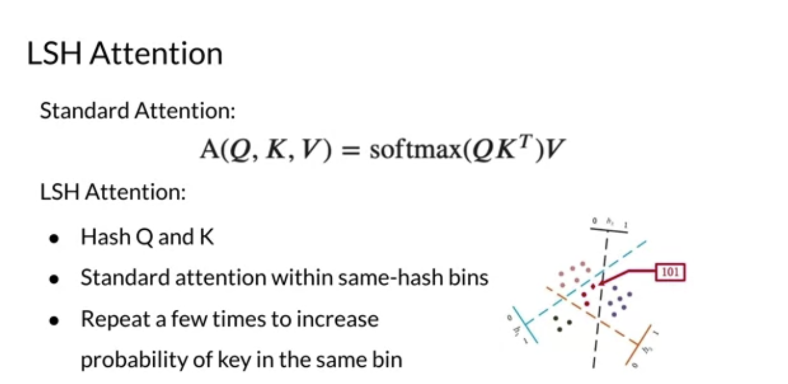
  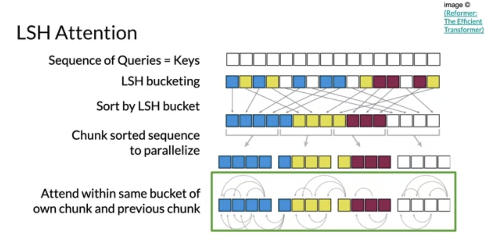

## 2.3 Motivations

- When total number of layers increases, emory required increases

  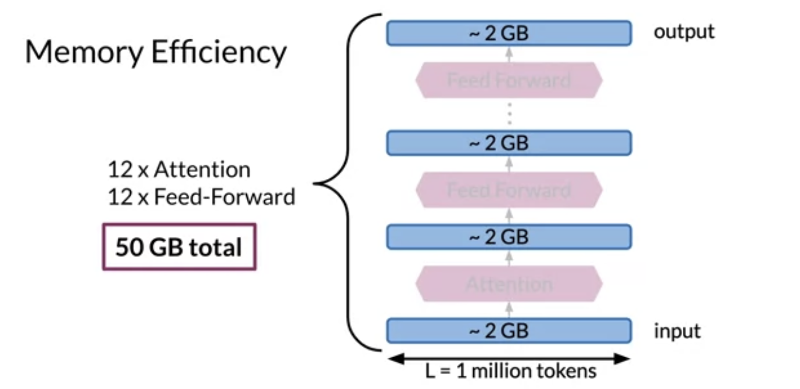

## 2.4 Reversible Residual Lyaers

- Euqations

  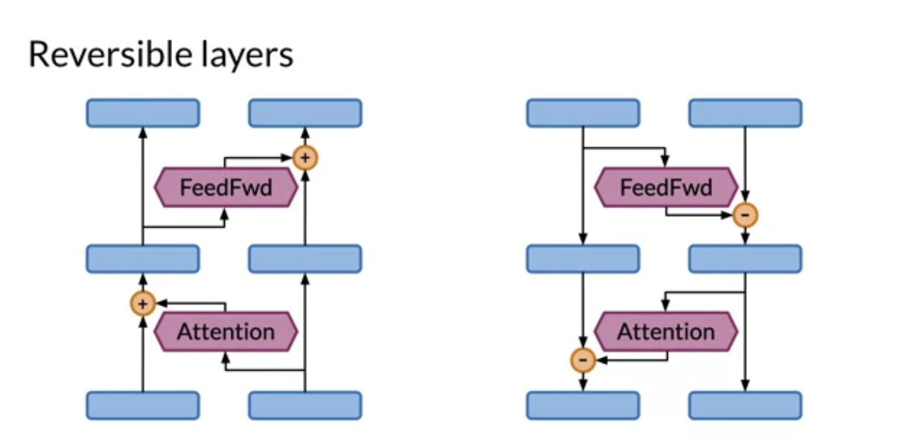
  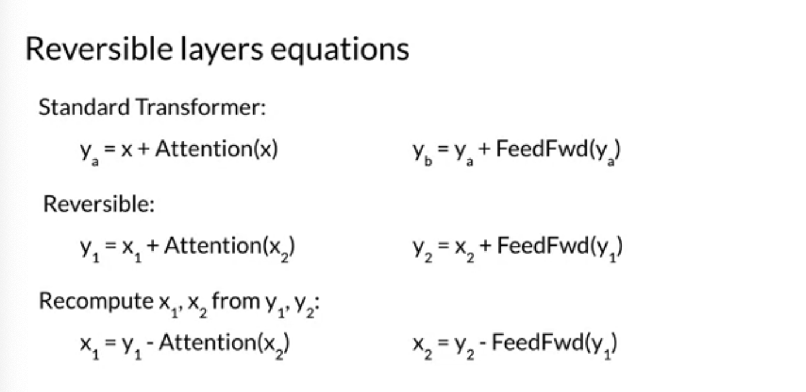

- Visualization

  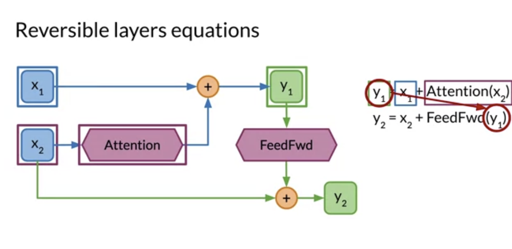
  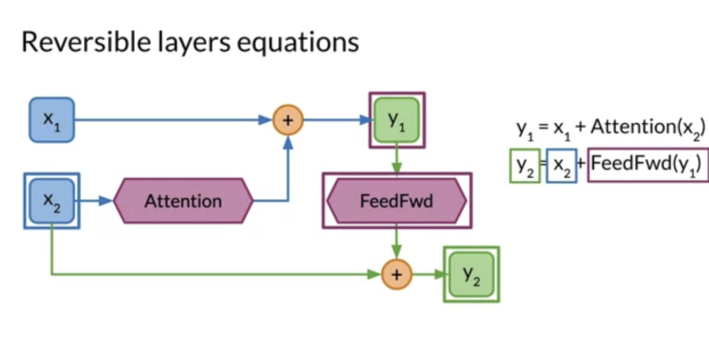

  
  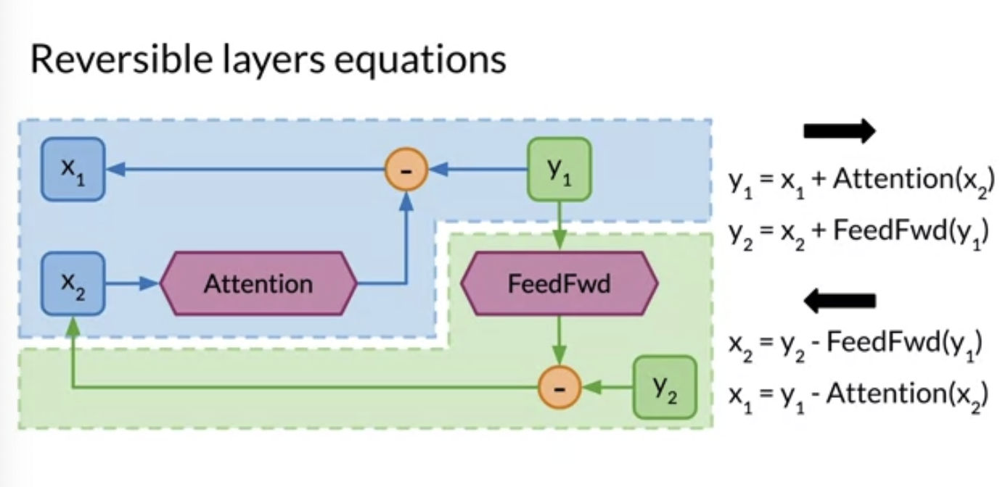

- BLEU performance

  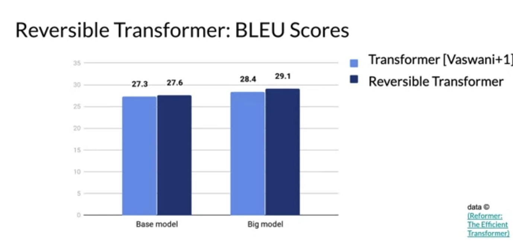

# 3 Reformer

- Application

  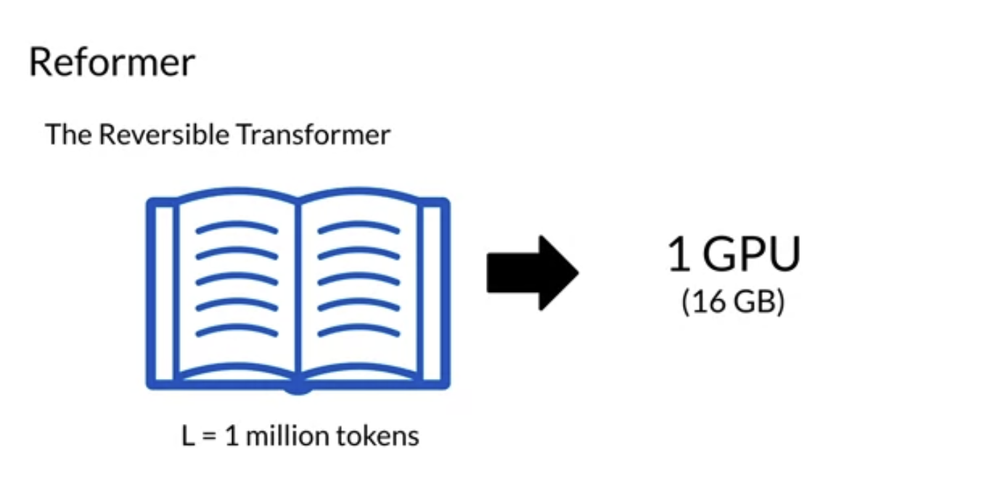

- Structure

  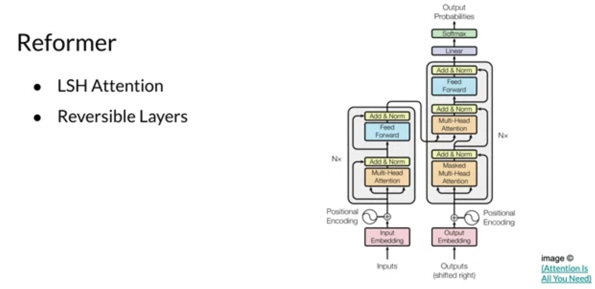

- Attention
  - How standard attention takes longer as sequence length increases
  - However, LSH attention taks roughly the same amout of time as sequence length increases
  - The only difference is more hashes taking slightly longer than fewer hashes regaredless of the sequence length

  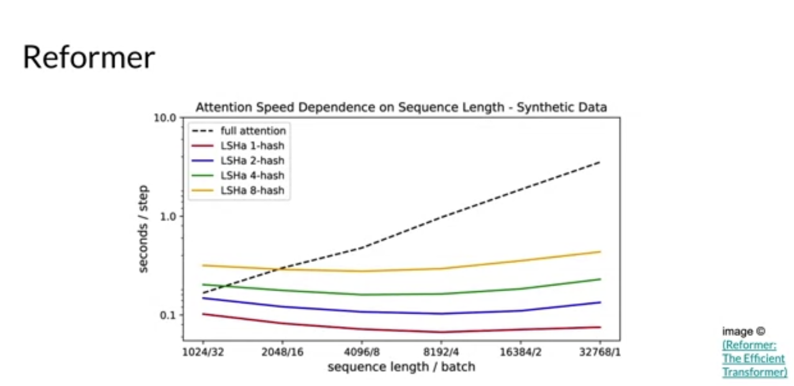

